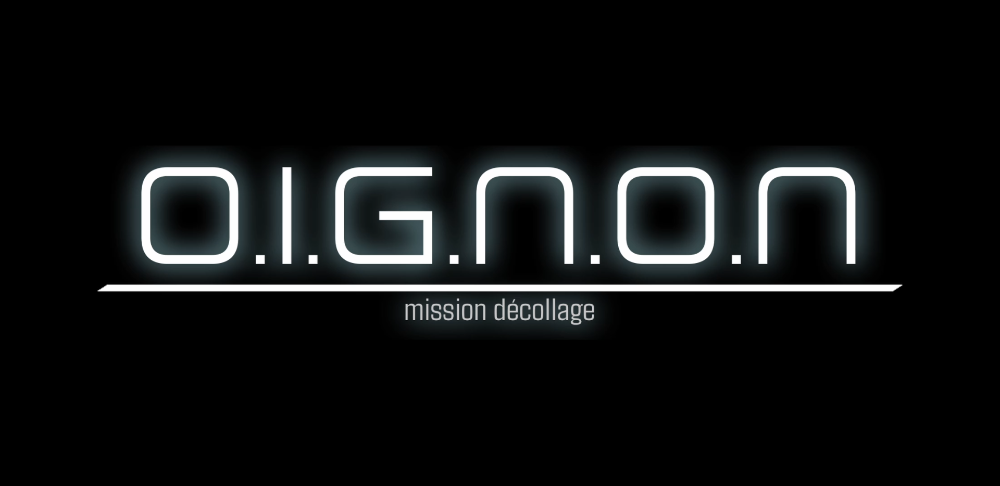

# Mission Décollage

<!-- Bannderole / Bande-annonce -->
 

## Description

<!-- Présentation de ce qu'est ce site et résumé du projet en un paragraphe, toujours à jour-->
Mission Décollage est une expérience coopérative pour 1 à 3 joueurs, chacun installé à un poste de commande différent. Chaque poste contrôle une partie de la fusée : réacteurs gauche et droit, stabilisation, propulsion, etc. Elle nécessite une coordination précise pour réussir le lancement depuis la Terre.

Une fois en vol, le ou les joueurs doivent atteindre l’orbite, esquiver les météorites et gérer la trajectoire vers la Lune, Mars, etc. Devant un grand tableau de bord, plusieurs éléments sont présents : boutons, curseurs et autres contrôles dynamiques pour simuler une cabine de pilotage immersive.
