# Concept

## Le pitch initial

<!-- Inclure la vidéo du PowerPoint intial -->

<!-- Méthode 1 -->
<iframe width="560" height="315" src="https://www.youtube.com/embed/zihf_Y3LZUM?si=Jb-KXUsQ10JkwI6d" title="YouTube video player" frameborder="0" allow="accelerometer; autoplay; clipboard-write; encrypted-media; gyroscope; picture-in-picture; web-share" referrerpolicy="strict-origin-when-cross-origin" allowfullscreen></iframe>

<!-- Méthode 2, plug legit -->
<!--

-->

<!-- Méthode 3 (vidéo local) -->
<!--
 
-->

## L'expérience

### Le parcours de l'interacteur

<!--
Comportement de l’interacteur
Qu'est-ce que fait l'interacteur?
un résumé du parcours de l'interacteur du début à la fin de son expérience - qu'est-ce qu'il fait, qu'est-ce qu'il manipule, etc
-->

L’interacteur arrive devant l’installation : Une grande table équipée de boutons, sliders, rotatifs différents disposés avec quatre chaises. Il s’assoit sur l’une d’elles, tandis que d’autres personnes prennent place sur les autres chaises.
Les interacteurs appuient sur le bouton qui clignote afin de rejoindre la mission, un chef doit être déterminé, lorsqu'un joueur appuie sur son bouton, il prend la place du chef, si les autres joueurs sont d'accord avec ce chef, ils doivent pivoter leur "angle sensor" pour confirmer, sinon, ils peuvent appuyer sur leur bouton pour se proposer comme chef. Une fois le chef choisi, le jeu commence. Ils utilisent alors leur bouton et leur "angle sensor" pour réussir le jeu. Une fois la partie terminée, ils se lèvent et s’en vont.

### L'espace

<!--
description de l'espace réel et virtuel du projet et comment l'espace réel est transposé, transorté ou prolongé dans le virtuel et inversement
-->

Des chaises sont disposées devant le mur où est projeté l’écran du jeu. Sur le tableau de contrôle (la table), un bouton et un "grove" sont présents permettant d’interagir avec la partie. Ces boutons/angles contrôlent différentes fonctions de la fusée, par exemple le réacteur gauche, le réacteur droit ou le réacteur principal. chacune de ces parties n'est contrôlée que par un des joueurs.
Des effets sonores et de la musique accompagnent les joueurs tout au long de l’aventure, diffusés soit dans des casques d’écoute, soit par des haut-parleurs intégrés aux chaises.

### La progression

<!--  sur le temps et la progression -->

L'expérience en temps réel dure approximativement 5 à 10 minutes, en ressenti environ 2-5 min. La progression sera comme suit:

- Les joueurs doivent se coordonner pour faire décoller la fusée sans s'écraser
- Les joueurs doivent quitter l'orbite de la planète Terre et esquiver les obstacles terrestres
- Les joueurs doivent naviguer dans l'espace et éviter les débris spaciaux
- Les joueurs doivent se coordonner pour faire atterir la fusée

### L'aspect collectif

<!--
comment votre idée de projet correspond au thème du COLLECTIF
Plus il y a de personnes qui peuvent interagir simultanément est un critère important !

Un collectif désigne l'ensemble de personnes ou d'entités qui s'unissent de manière concertée pour poursuivre un objectif commun, en coopérant et en collaborant pour atteindre des buts qui seraient difficiles à réaliser individuellement.
 Il peut s'agir d'une réunion informelle ou contractuelle, temporaire ou durable, constituée autour d'une cause, d'une action ou d'un projet, qu'il soit artistique, politique, professionnel, moral ou cultuel.
 Ce groupe, souvent considéré comme une entité à vocation communautaire, fonctionne sous le pilotage de ses membres et repose sur une volonté partagée de développer des solidarités.
-->

Dans Mission décollage, les joueurs sont des astronautes qui effectuent la première mission sur Mars. Leur but est d'atterir sur la dite planète sein et sauf afin de marquer l'histoire et potentiellement découvrir la vie sur Mars.
Les joueurs font partie de la mission O.I.G.N.O.N "Opération Internationale en Géosciences, Navigation et Observation du Nouveau-monde" qui a comme objectif d'explorer les confins spatiaux et ses mystères. Tout les joueurs sont à
bord la fusée, qui s'apprête à décoller en direction de Mars. Ensemble, ils devront coopérer efficacement pour réussir leur aventure héroique ! Mais attention, ce ne sera pas
sans dangers, les joueurs devront faire des décisions déchirantes afin de réussir leur objectif.

### L'aspect social

<!--
comment votre idée de projet correspond au thème du SOCIAL

Le terme « social » désigne ce qui concerne la vie en société, c’est-à-dire les relations entre les individus au sein d’un groupe organisé, ainsi que les structures, normes et institutions qui en découlent.
 Il peut s’appliquer à des aspects variés, comme la vie sociale, les groupes sociaux, les classes sociales, les rapports de production, ou encore les politiques visant à améliorer les conditions de vie des individus.
 En sciences sociales, le social englobe l’étude des phénomènes collectifs, des interactions humaines, des normes sociales et des dynamiques de pouvoir au sein de la société.
 L’adjectif peut aussi qualifier des animaux ou des plantes vivant en communauté selon des règles strictes, comme les insectes sociaux (fourmis, abeilles) ou certaines espèces végétales formant des colonies denses.
-->

Le jeu est jouable par un maximum de 4 joueurs, ce qui en soit n'est pas beaucoup, cependant, le jeu est également possible à 1, 2 ou 3 joueurs. Lorsque le jeu est joué à moins de joueurs, les contrôles de
la fusée sont répartis entre moins d'intéracteurs, ce qui intensifie l'expérience et la rend plus compliquée. Plus il y a de joueurs, plus il sera simple de faire naviguer la fusée.
Les intéracteurs devront inévitablement communiquer entre eux afin de parvenir à faire décoller/Naviguer/atterir la fusée, forcant les joueurs à intéragir entre eux de façon orale et "physique" à
l'intérieur du jeu, où chacune des intéractions qu'ils effectueront auront un impact énorme sur le résultat final et les prochaines intéractions.

## Inspirations

### Inspirations visuelles et sonores

<!-- Inclure le moodboard avec référenes pour chacune des sources-->

### Images inspirantes

Représentations visuelles de l'ambiance recherchée, que ce soit à travers des photographies, des illustrations, ou des œuvres existantes.
| Visuel 1 | Visuel 2 | Visuel 3 |
|-----------|-----------|-----------|
| 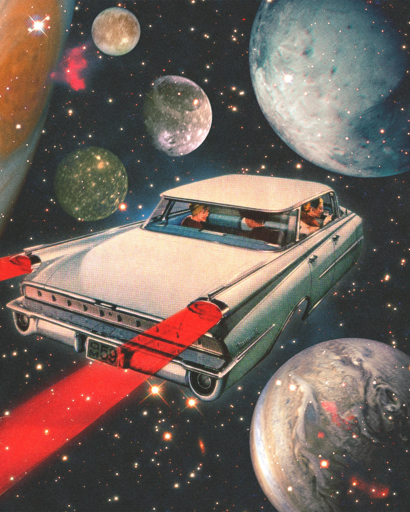 | 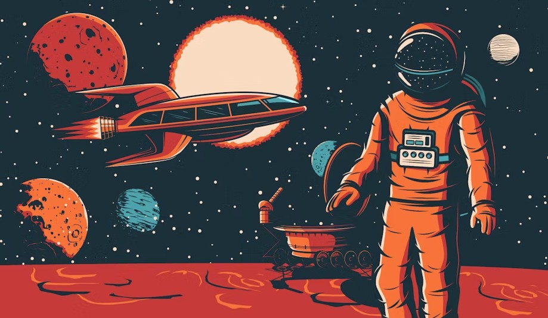 | 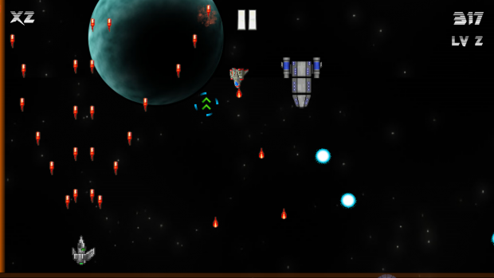 |
| [Source: Reddit](https://www.reddit.com/r/scifi/comments/10xqbmg/space_trip_retrofuturistic_artwork_done_by_me/) | [Source: 99designs](https://99designs.fr/profiles/1193222) | [Source: moddb](https://www.moddb.com/games/space-shooter-90/images/w1#imagebox) |

### Palette de couleurs

Choix de couleurs qui influenceront l’éclairage, les médias projetés, ou l’interface visuelle.

### Références multimédia

Vidéos, musiques ou sons, séquences animées qui capturent l’énergie ou la tonalité souhaitée pour l'installation.

- Vidéo : [Dust (court-métrage)](https://www.youtube.com/watch?v=t8LD0iUYv80)  
  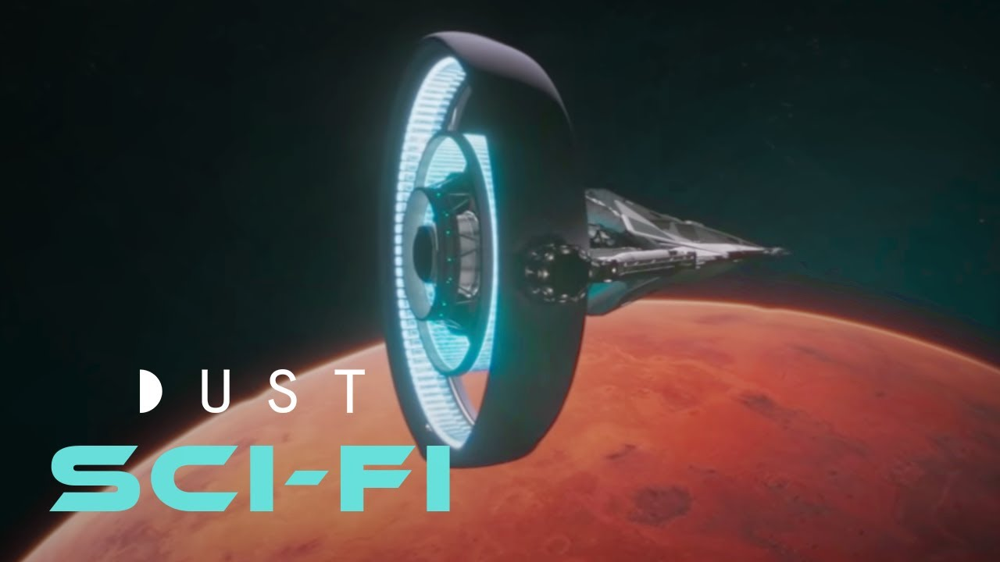  
  Court-métrage sur l'exploration spatiale que nous utilisons comme référence pour le design futuriste du vaisseau.

---

- Vidéo : [ATLAS (animation)](https://www.youtube.com/watch?v=-h34GHq_m7I&t=93s)  
  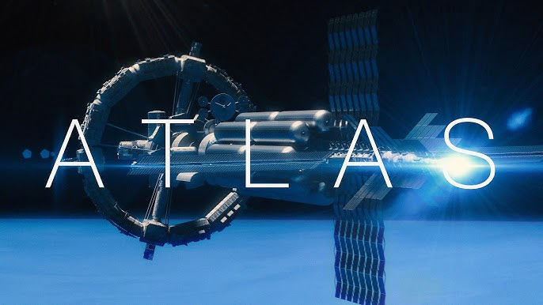  
  Court-métrage qui nous inspire pour l'aspect esthétique de l'environnement du jeu.

---

- Musique de jeu : [Mass Effect Theme](https://www.youtube.com/watch?v=TGReRiUSJ4Q&list=PL-qJR84og1cDsmpSYFR4NVLjU799STtBx&index=1)  
  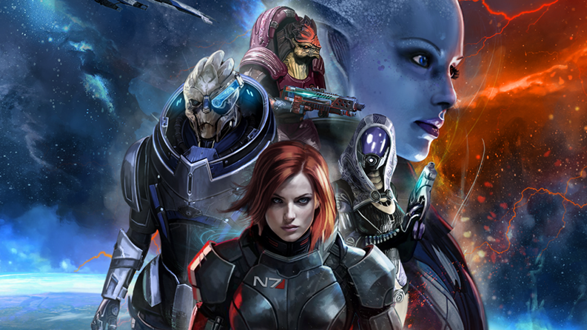  
  Pour l’ambiance de science-fiction et de mystère liée à l’espace et à sa grandeur.

---

- Musique : [2001: A Space Odyssey – Theme Song](https://www.youtube.com/watch?v=QwxYiVXYyVs&list=RDQwxYiVXYyVs&start_radio=1)  
    
  Apporte une tonalité solennelle et grandiose à l’exploration spatiale.

---

- Musique : [Interstellar Official Soundtrack – Cornfield Chase (Hans Zimmer)](https://www.youtube.com/watch?v=JuSsvM8B4Jc&list=RDJuSsvM8B4Jc&start_radio=1)  
    
  Musique inspirante et émotive qui pourrait bien représenter l’accomplissement de l’exploration spatiale.

---

### Textures et matériaux

Échantillons ou représentations de matériaux tangibles qui seront utilisés dans l'installation (écrans, surfaces tactiles, objets physiques interactifs).

- Chaises avec accoudoirs
- Projecteur projetant au mur
- Boutons

| Chaise                                                           | Projecteur                                                                                                                                        | Bouton poussoir                                                                                                                                                                      |
| ---------------------------------------------------------------- | ------------------------------------------------------------------------------------------------------------------------------------------------- | ------------------------------------------------------------------------------------------------------------------------------------------------------------------------------------ |
| 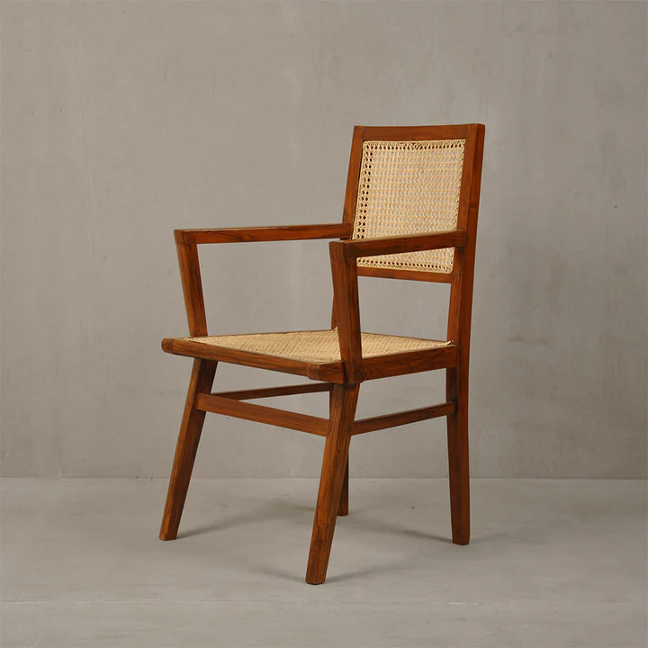                      |                                                                                                         | 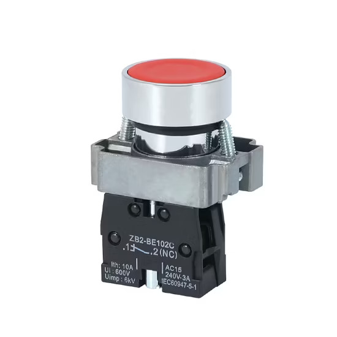                                                                                                                                      |
| [Source: Calcuttan](https://www.calcuttan.in/products/abp-chair) | [Source: Epson](https://epson.ca/Pour-le-travail/Projecteurs/Projecteurs-pour-salle-de-classe-/Projecteur-PowerLite-990U-WUXGA-3LCD/p/V11H867020) | [Source: Made-in-China](https://gwiecelectric.en.made-in-china.com/product/JGWUFoljankf/China-Manufacture-22mm-Xb2-Series-Engine-Start-Stop-Latching-Push-Button-Rotary-Switch.html) |

### Ambiance sonore

Inspirations relatives à la scénarisation du son, qui seront des éléments interactifs clés dans l’expérience utilisateur.

🚀 Boost Initial  
[Son demonstrative.mp3](boost.mp3)

> Accélération puissante au démarrage.

🚀 Boost Secondaire  
[boost.mp3](boost.mp3)

> Impulsion rapide, effet de propulsion.

🚀 Boost Final  
[boost2.mp3](boost2.mp3)

> Dernier souffle avant le décollage.

🔨 Clank Brut  
[clank.mp3](clank.mp3)

> Choc métallique sec.

🔨 Clank Écho  
[clank2.mp3](clank2.mp3)

> Résonance prolongée après impact.

🔨 Clank Sourd  
[clank3.mp3](clank3.mp3)

> Bruit étouffé, lourd.

🔨 Clank Tranchant  
[clank4.mp3](clank4.mp3)

> Impact vif et métallique.

🔨 Clank Final  
[clank5.mp3](clank5.mp3)

> Dernier bruit avant silence.

🔨 Clank Répétitif  
[clank6.mp3](clank6.mp3)

> Série de chocs rapprochés.

💥 Crash Brutal  
[crash.mp3](crash.mp3)

> Collision violente, désordre.

⚠️ Alerte Danger  
[danger.mp3](danger.mp3)

> Signal d’urgence imminent.

🌀 Dash Rapide  
[dash.mp3](dash.mp3)

> Déplacement éclair.

🌀 Dash Fantôme  
[dash2.mp3](dash2.mp3)

> Passage furtif, presque inaudible.

💣 Explosion  
[explosion.mp3](explosion.mp3)

> Détonation puissante.

📡 Interférence  
[interfernce.mp3](interference.mp3)

> Intéférence électroniques.

🔫 Lazer  
[lazer.mp3](lazer.mp3)

> Tir énergétique concentré.

☄️ Météorite  
[meteor.mp3](meteor.mp3)

> Impact cosmique.

✨ Résurrection  
[resurection.mp3](resurection.mp3)

> Retour à la vie après l'explosion du vaisseau.

➕ Soin  
[soin.mp3](soin.mp3)

> Guérison instantanée.

### Inspirations interactives

<!-- Inclure des liens et une ligne sur pourquoi -->

- [Keep Talking and Nobody Explodes](https://keeptalkinggame.com/)  
   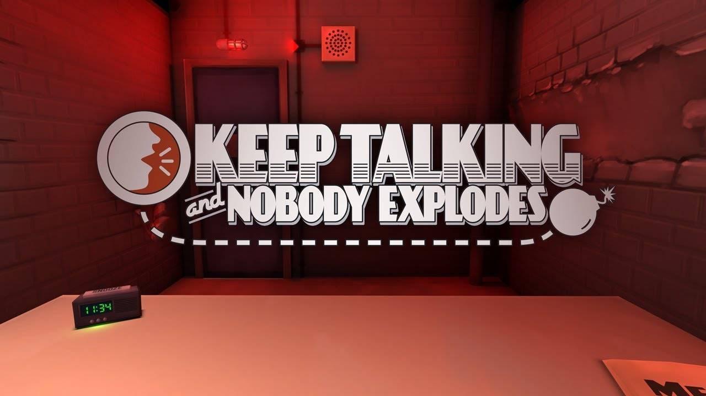  
  Un jeu où la communication est la clé. Les joueurs communiquent afin de désamorcer une bombe avant son explosion.

- [Sea of Thieves](https://www.seaofthieves.com/)
     
  Un jeu intéractif où les joueurs coopèrent afin de diriger un bateau pirate à travers les mers.

  - [Space Team](https://spaceteam.ca/)
     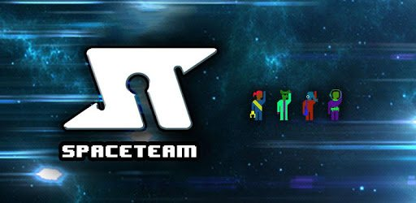
    Le jeu oblige les joueurs à se coordonner afin de survivre et de passer au niveau suivant.

### Scénarimage

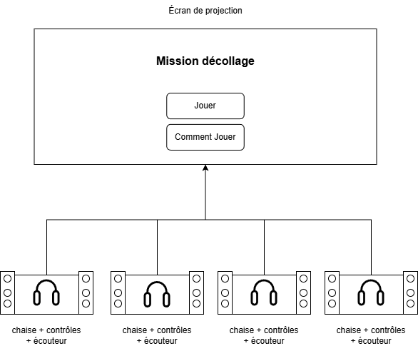

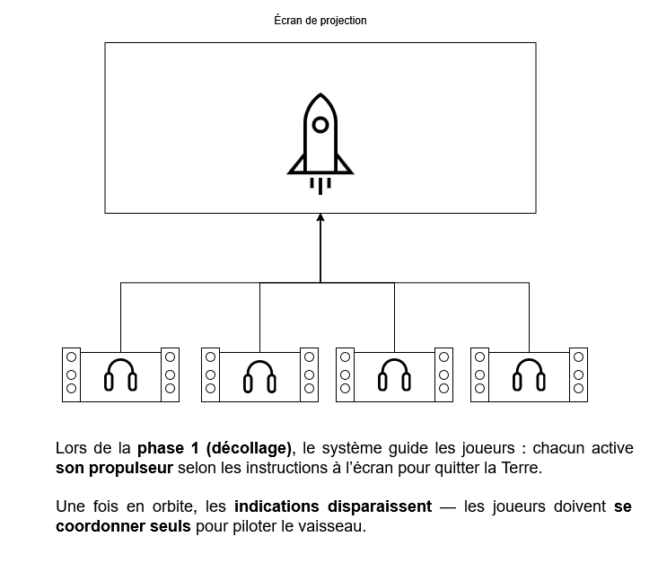

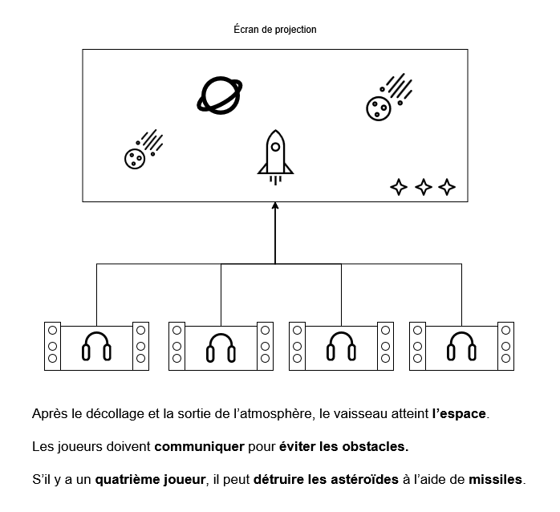

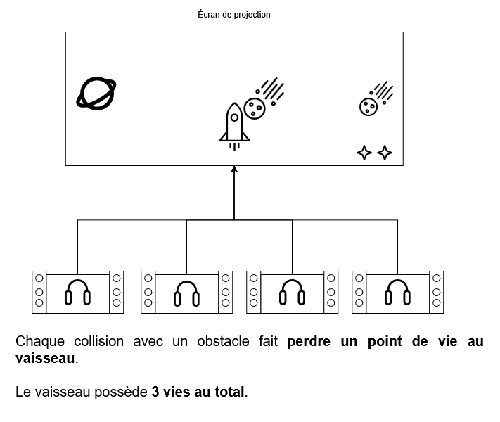

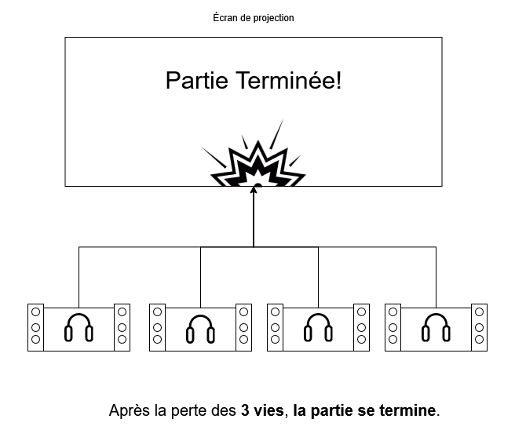

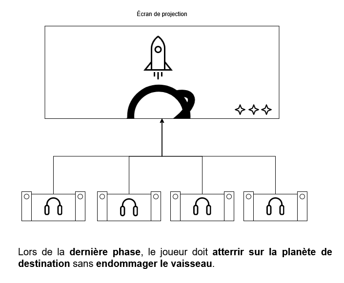

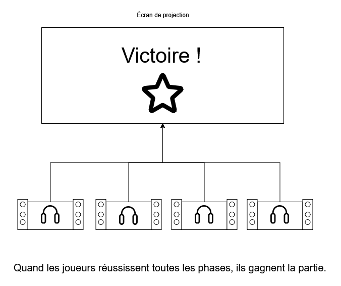

<!-- Pour chaque étape/scène : une image avec du texte descriptif et une explication de la transition -->

<!--
Éléments du scénarimage
Séquence visuelle
Chaque scène ou séquence du scénarimage doit être clairement illustrée, montrant les éléments visuels qui seront projetés ou affichés. Cette séquence visuelle peut inclure des captures d'écran, des croquis ou des rendus 3D, en fonction des besoins du projet.

Points d'interaction
Le scénarimage dans un cadre interactif inclut les moments où l'utilisateur interagit avec l'installation. Ces points d’interaction doivent être représentés graphiquement pour indiquer comment et quand l’utilisateur influencera la progression du récit ou des effets visuels et sonores.

Évolution du récit
Comme pour le scénario narratif, le scénarimage doit montrer la progression de l’histoire ou de l’expérience au fil des interactions. Il permet de visualiser comment l’installation évolue en fonction des actions de l'utilisateur, avec des embranchements possibles selon ses choix.

Retour visuel et sensoriel
Le scénarimage doit inclure des annotations ou des visuels montrant les réponses visuelles, sonores ou tactiles à chaque interaction. Cela peut inclure des changements d’éclairage, des transitions vidéo, ou des effets sonores qui réagissent aux actions de l’utilisateur.
-->
