# Concept

## Le pitch initial

<!-- Inclure la vidéo du PowerPoint intial -->

<!-- Méthode 1 -->
<iframe width="560" height="315" src="https://www.youtube.com/embed/zihf_Y3LZUM?si=Jb-KXUsQ10JkwI6d" title="YouTube video player" frameborder="0" allow="accelerometer; autoplay; clipboard-write; encrypted-media; gyroscope; picture-in-picture; web-share" referrerpolicy="strict-origin-when-cross-origin" allowfullscreen></iframe>

<!-- Méthode 2, plug legit -->
<!--

-->

<!-- Méthode 3 (vidéo local) -->
<!--
 
-->

## L'expérience

### Le parcours de l'interacteur

<!--
Comportement de l’interacteur
Qu'est-ce que fait l'interacteur?
un résumé du parcours de l'interacteur du début à la fin de son expérience - qu'est-ce qu'il fait, qu'est-ce qu'il manipule, etc
-->

Les interacteurs arrivent devant l’installation : Un large panneau de contrôle équipée de boutons, sliders, rotatifs différents. Ces derniers se placent devant l'installation et sont invités 
à appuyer sur un bouton afin de rejoindre la mission. 

### L'espace

<!--
description de l'espace réel et virtuel du projet et comment l'espace réel est transposé, transorté ou prolongé dans le virtuel et inversement
-->

Le jeu est projeté sur un mur, et sur le tableau de contrôle (la table), un bouton et un "grove" sont présents permettant d’interagir avec la partie. Ces boutons/angles contrôlent différentes fonctions de la fusée, par exemple le réacteur gauche, le réacteur droit ou le réacteur principal. chacune de ces parties n'est contrôlée que par un des joueurs.
Des effets sonores et de la musique accompagnent les joueurs tout au long de l’aventure, diffusés via des haut-parleurs.

### La progression

<!--  sur le temps et la progression -->

L'expérience en temps réel dure approximativement 5 à 10 minutes, en ressenti environ 2-5 min. La progression sera comme suit:

- Les joueurs ont 30 secondes pour comprendre leur rôle, le fonctionnement des contrôles et leur fonctionnement du jeu dans un tutoriel après avoir commencer le jeu
- La partie du jeu commence et les joueurs doivent se coordonner pour faire décoller la fusée sans s'écraser
- Les joueurs doivent quitter l'orbite de la planète Terre et esquiver les obstacles terrestres
- Les joueurs doivent naviguer dans l'espace et éviter les débris spaciaux
- Les joueurs doivent se coordonner pour faire atterir la fusée

### L'aspect collectif

<!--
comment votre idée de projet correspond au thème du COLLECTIF
Plus il y a de personnes qui peuvent interagir simultanément est un critère important !

Un collectif désigne l'ensemble de personnes ou d'entités qui s'unissent de manière concertée pour poursuivre un objectif commun, en coopérant et en collaborant pour atteindre des buts qui seraient difficiles à réaliser individuellement.
 Il peut s'agir d'une réunion informelle ou contractuelle, temporaire ou durable, constituée autour d'une cause, d'une action ou d'un projet, qu'il soit artistique, politique, professionnel, moral ou cultuel.
 Ce groupe, souvent considéré comme une entité à vocation communautaire, fonctionne sous le pilotage de ses membres et repose sur une volonté partagée de développer des solidarités.
-->

Dans Mission Décollage, les joueurs incarnent des astronautes chargés d’accomplir la toute première mission de d'exploration vers Mars. Leur objectif est d’atterrir sur la planète sains et saufs, afin de marquer l’histoire et, peut-être, de découvrir des traces de vie.

Ils font partie de la mission O.I.G.N.O.N — Opération Internationale en Géosciences, Navigation et Observation du Nouveau-Monde — dont la vocation est d’explorer les confins spatiaux et leurs mystères. Tous les joueurs se trouvent à bord de la fusée qui s’apprête à décoller en direction de Mars.

Ensemble, ils devront planifier, coordonner leurs actions et prendre des décisions de manière efficace pour mener à bien cette aventure héroïque ! Mais attention : les dangers seront nombreux, et les joueurs devront parfois faire des choix difficiles pour atteindre leur objectif.

### L'aspect social

<!--
comment votre idée de projet correspond au thème du SOCIAL

Le terme « social » désigne ce qui concerne la vie en société, c’est-à-dire les relations entre les individus au sein d’un groupe organisé, ainsi que les structures, normes et institutions qui en découlent.
 Il peut s’appliquer à des aspects variés, comme la vie sociale, les groupes sociaux, les classes sociales, les rapports de production, ou encore les politiques visant à améliorer les conditions de vie des individus.
 En sciences sociales, le social englobe l’étude des phénomènes collectifs, des interactions humaines, des normes sociales et des dynamiques de pouvoir au sein de la société.
 L’adjectif peut aussi qualifier des animaux ou des plantes vivant en communauté selon des règles strictes, comme les insectes sociaux (fourmis, abeilles) ou certaines espèces végétales formant des colonies denses.
-->

Les joueurs seront debout devant le tableau de bord, et chacun devra gérer les tâches en temps réel. Cette disposition favorise directement les interactions humaines : la communication devient essentielle pour réussir. Les joueurs devront échanger verbalement, s’encourager, signaler les erreurs et se répartir les tâches efficacement. Ainsi, la réussite du jeu dépend entièrement de leurs interactions sociales et de leur capacité à collaborer entre eux.

### L'espace virtuel

Le jeu commence dans un monde en trois dimension de la planète terre, la vue est en troisième personne (top down) sur une fusée, qui s'apprête à décoller. Lors du décollage et de l'atterissage, la vue sera en top down, lors de la phase dans l'espace, la vue sera à la première personne (vue du cockpit). Les joueurs feront décoller la fusée jusque dans l'espace, puis se rendront jusqu'à l'atmosphère de Mars, avant de la faire atterir sur la dite planète.

## Inspirations

### Inspirations visuelles et sonores

<!-- Inclure le moodboard avec référenes pour chacune des sources-->

### Images inspirantes

Représentations visuelles de l'ambiance recherchée, que ce soit à travers des photographies, des illustrations, ou des œuvres existantes.
| Visuel 1 | Visuel 2 | Visuel 3 |
|-----------|-----------|-----------|
|  |  |  |
| [Source: Reddit](https://www.reddit.com/r/scifi/comments/10xqbmg/space_trip_retrofuturistic_artwork_done_by_me/) | [Source: 99designs](https://99designs.fr/profiles/1193222) | [Source: moddb](https://www.moddb.com/games/space-shooter-90/images/w1#imagebox) |

### Palette de couleurs

Choix de couleurs qui influenceront l’éclairage, les médias projetés, ou l’interface visuelle.

### Références multimédia

Vidéos, musiques ou sons, séquences animées qui capturent l’énergie ou la tonalité souhaitée pour l'installation.

- Jeu : [Galaga Legions](https://www.youtube.com/watch?v=g1nYvdUFbdA&t=284s)  
  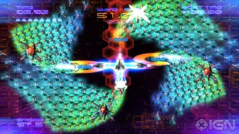  
  Jeu topdown en 3d qui nous inspire pour l'aesthetique visuelle du vaiseau.

---

- Jeu : [ΔV: Rings of Saturn](https://www.youtube.com/watch?v=qoykm2x2WDk)  
  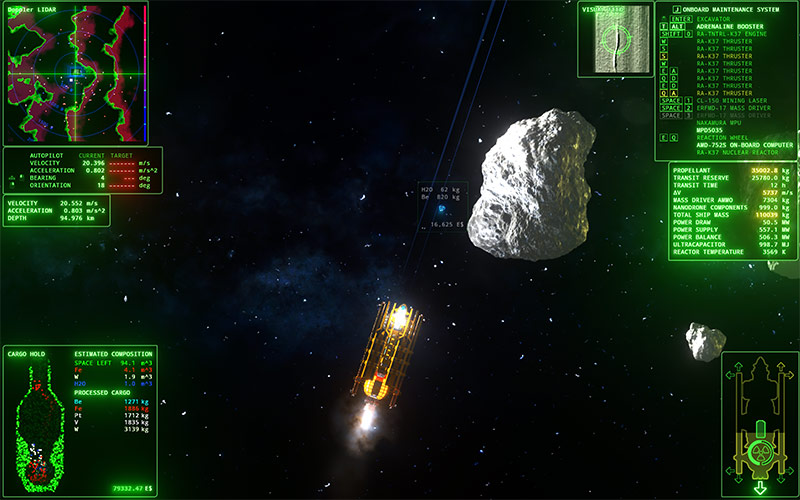  
  Jeu topdown en 3d qui nous inspire pour l'aesthetique visuelle de l'environnement .

---

- Musique de jeu : [Mass Effect Theme](https://www.youtube.com/watch?v=TGReRiUSJ4Q&list=PL-qJR84og1cDsmpSYFR4NVLjU799STtBx&index=1)  
    
  Pour l’ambiance de science-fiction et de mystère liée à l’espace et à sa grandeur.

<!--
- Musique de jeu : [EVE Online - Theme Of The Universe](https://www.youtube.com/watch?v=OAUNRgCo7ps)
  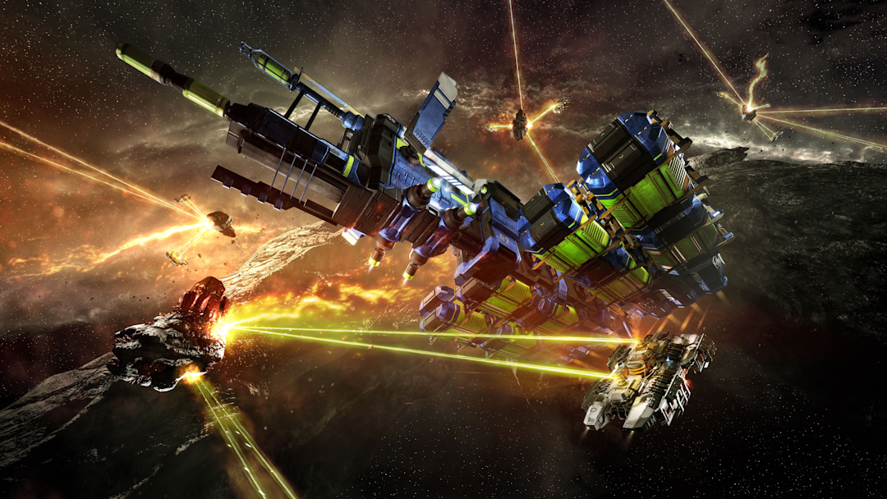
  Cette musique nous inspire pour le thème qui jouera dans la scène de jeu. Elle crée une atmosphère de mystère et de grandeur, en lien avec l’exploration spatiale.
  -->

---

- Musique : [2001: A Space Odyssey – Theme Song](https://www.youtube.com/watch?v=QwxYiVXYyVs&list=RDQwxYiVXYyVs&start_radio=1)  
    
  Apporte une tonalité solennelle et grandiose à l’exploration spatiale.

<!--
- Musique de jeu : [Kerbal Space Program Theme](https://www.youtube.com/watch?v=-idB7XK2xI8)
  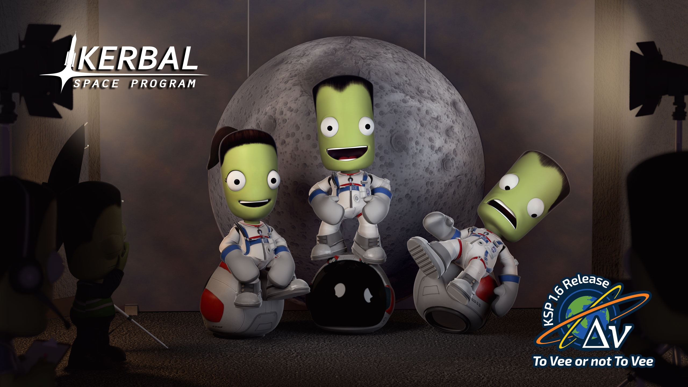
  Cette musique nous inspire pour le thème et l’ambiance du menu principal. Elle donne une atmosphère ambitieuse et épique.
  -->

---

- Musique : [Interstellar Official Soundtrack – Cornfield Chase (Hans Zimmer)](https://www.youtube.com/watch?v=JuSsvM8B4Jc&list=RDJuSsvM8B4Jc&start_radio=1)  
    
  Musique inspirante et émotive qui pourrait bien représenter l’accomplissement de l’exploration spatiale.

<!--
- Musique de jeu : [XCOM 2 OST - Mission Failure](https://www.youtube.com/watch?v=pPU_lbpLNuE)
  
  Cette musique nous inspire pour le thème de partie perdue : elle crée une ambiance déceptive et dramatique, qui reflète bien le fait que les joueurs n’ont pas réussi leur mission.
  -->

---

### Textures et matériaux

Échantillons ou représentations de matériaux tangibles qui seront utilisés dans l'installation (écrans, surfaces tactiles, objets physiques interactifs).

- Projecteur projetant au mur
- Boutons

| Chaise                                                           | Projecteur                                                                                                                                        | Bouton poussoir                                                                                                                                                                      |
| ---------------------------------------------------------------- | ------------------------------------------------------------------------------------------------------------------------------------------------- | ------------------------------------------------------------------------------------------------------------------------------------------------------------------------------------ |
|                       |                                                                                                         |                                                                                                                                       |
| [Source: Calcuttan](https://www.calcuttan.in/products/abp-chair) | [Source: Epson](https://epson.ca/Pour-le-travail/Projecteurs/Projecteurs-pour-salle-de-classe-/Projecteur-PowerLite-990U-WUXGA-3LCD/p/V11H867020) | [Source: Made-in-China](https://gwiecelectric.en.made-in-china.com/product/JGWUFoljankf/China-Manufacture-22mm-Xb2-Series-Engine-Start-Stop-Latching-Push-Button-Rotary-Switch.html) |

Voici une reformulation plus sobre et structurée, sans émoticônes, avec une mise en forme claire et un ton plus humain :  

---

### Ambiance sonore

**Boost initial**  
[Son demonstrative.mp3](boost.mp3)  
Utilisé lors du lancement de la fusée ou du glissement du slider.

**Boost final**  
[boost2.mp3](boost2.mp3)  
Se déclenche lorsque l’un des réacteurs additionnels est activé.

**Clank de base**  
[clank.mp3](clank.mp3)  
Produit lorsque la fusée entre en collision avec un objet.

**Crash brutal**  
[crash.mp3](crash.mp3)  
Correspond à l’explosion de la fusée.

**Alerte danger**  
[danger.mp3](danger.mp3)  
Signal sonore indiquant que la fusée est sur le point d’exploser.

<!--**Dash rapide**  
[dash.mp3](dash.mp3)  
Pourrait être utilisé lorsque la fusée esquive un obstacle en faisant un dash.
-->

**Parasites électroniques**  
[interference.mp3](interference.mp3)  
Se déclenche lorsque la fusée est endommagée et dure quelques secondes.

### Inspirations interactives

<!-- Inclure des liens et une ligne sur pourquoi -->

- [Keep Talking and Nobody Explodes](https://keeptalkinggame.com/)  
     
  Un jeu où la communication est la clé. Les joueurs communiquent afin de désamorcer une bombe avant son explosion.

- [Sea of Thieves](https://www.seaofthieves.com/)
     
  Un jeu intéractif où les joueurs coopèrent afin de diriger un bateau pirate à travers les mers.

  - [Space Team](https://spaceteam.ca/)
     
    Le jeu oblige les joueurs à se coordonner afin de survivre et de passer au niveau suivant.

### Scénarimage

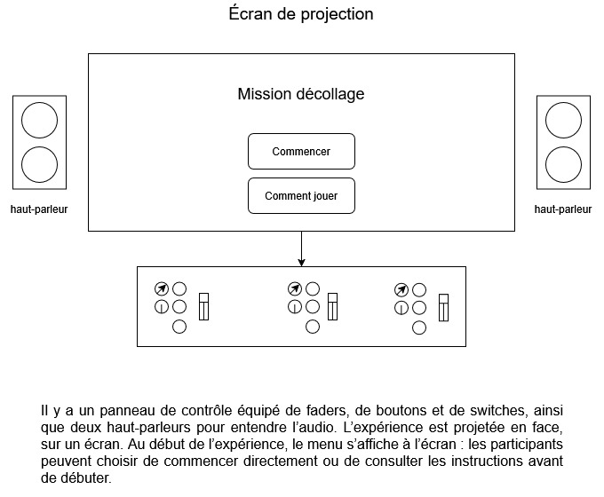

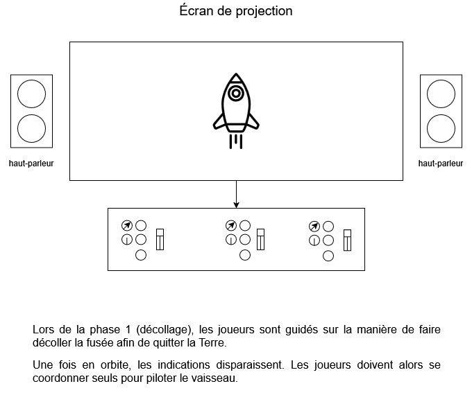

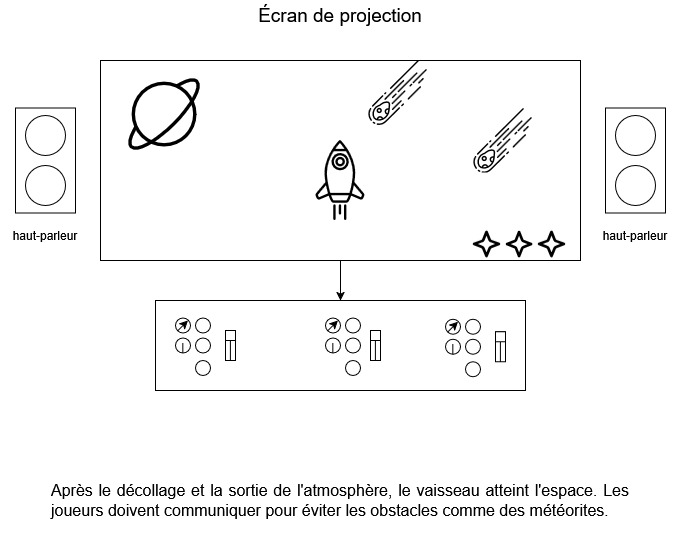

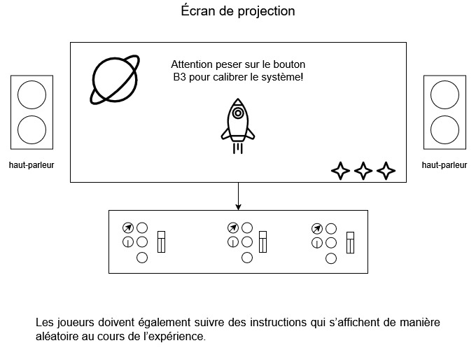

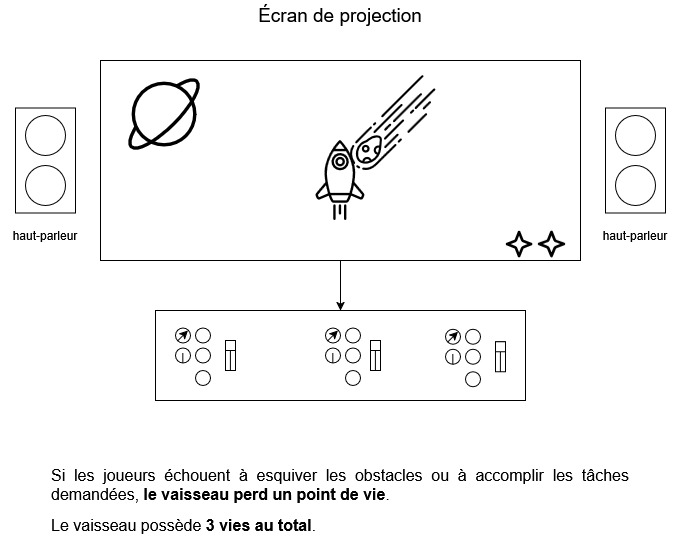

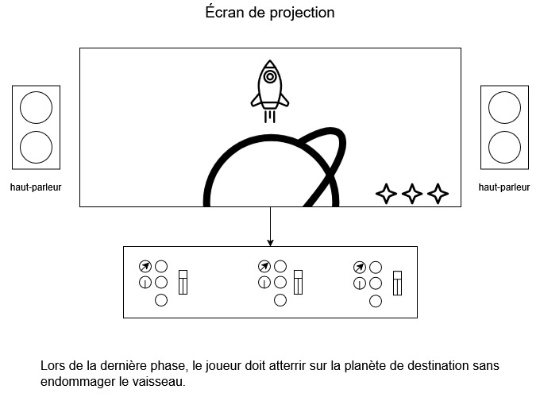

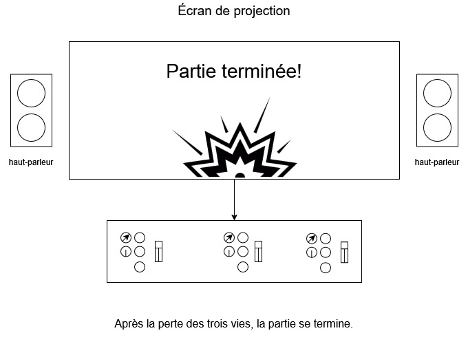

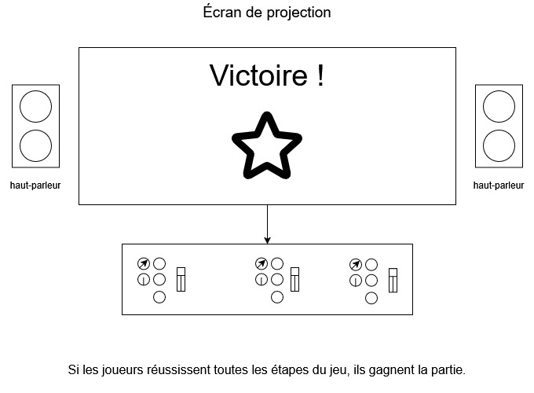

<!-- Pour chaque étape/scène : une image avec du texte descriptif et une explication de la transition -->

<!--
Éléments du scénarimage
Séquence visuelle
Chaque scène ou séquence du scénarimage doit être clairement illustrée, montrant les éléments visuels qui seront projetés ou affichés. Cette séquence visuelle peut inclure des captures d'écran, des croquis ou des rendus 3D, en fonction des besoins du projet.

Points d'interaction
Le scénarimage dans un cadre interactif inclut les moments où l'utilisateur interagit avec l'installation. Ces points d’interaction doivent être représentés graphiquement pour indiquer comment et quand l’utilisateur influencera la progression du récit ou des effets visuels et sonores.

Évolution du récit
Comme pour le scénario narratif, le scénarimage doit montrer la progression de l’histoire ou de l’expérience au fil des interactions. Il permet de visualiser comment l’installation évolue en fonction des actions de l'utilisateur, avec des embranchements possibles selon ses choix.

Retour visuel et sensoriel
Le scénarimage doit inclure des annotations ou des visuels montrant les réponses visuelles, sonores ou tactiles à chaque interaction. Cela peut inclure des changements d’éclairage, des transitions vidéo, ou des effets sonores qui réagissent aux actions de l’utilisateur.
-->
