# Jad Saloumi

## Planification

Cette section, complétée lors de la première semaine, présente les tâches individuelles **hebdomadaires** prévues.

<!--
- Planification sur 9 semaines (8 semaines de cours et 1 semaine de rattrapage) présentant les tâches individuelles hebdomadaires prévues.
- Au moins une tâche par semaine. Les tâches ne peuvent pas se répéter et doivent être suffisamment précises.
- Les tâches doivent être cohérentes avec celles des autres membres de l’équipe et avec le concept du projet, et être mises à jour en continu.
- Critères :
    - Intention et concept clairs
    - Description approfondie de la conception sonore et visuelle
    - Planification détaillée du contenu multimédia à intégrer
    - Planification technique rigoureuse
-->

### Semaine 1

- Mettre à jour le site web (équipe, scénario, technique, dossier de presse, exposition).

### Semaine 2

- Emprunter le matériel nécessaire pour l’enregistrement des sons.

- Enregistrer les sons suivants pour la création des effets sonores manquants :

  - Bruit des oiseaux

  - Bruit de réacteur (feu)

  - Bruit de collision avec un oiseau

  - Bruit de vent

  - Bruits de narration (dialogues)

  - Bruit de bris électrique de la fusée

### Semaine 3

- Intégrer les effets sonores pour le prototype (porte-ouverte).
- Tester la réactivité sonore aux entrées utilisateur.

### Semaine 4

- Ajuster les interactions sonores à partir des tests effectués (latence, déclenchement, intensité).
- Définir les repères visuels nécessaires aux interactions sonores (zones d’activation, feedback visuel).
- Tester la cohérence de base entre les sons et les éléments visuels (sans synchronisation finale).

### Semaine 5

- Synchroniser sons interactifs et animations simples.

### Semaine 6

- Tester cohérence audio-visuelle.

### Semaine 6.5

- Optimiser fichiers audio.

### Semaine 7
- Tester la stabilité sonore dans des conditions d’utilisation prolongées.
- Participer aux tests qualité (focus interactions sonores).

### Semaine 8

- Documenter les choix audio et leur rôle dans l’interactivité.

## Journal de bord

Cette section, complétée **quotidiennement** pendant l’exécution du projet, documente le travail individuel réellement réalisé chaque jour.

<!--
- Une entrée par jour sur 8 semaines (8 semaines à partir de la semaine 2).
   - Un total d'au moins 40 entrées uniques!
- Chaque jour :
    - Documentstion visuelle et/ou sonore du travail effectué
    - Lien vers les billets GitHub résolus
- Démarche rigoureuse de validation de la qualité
- Démonstration d'autonomie.
- Exécution technique précise et complète.
- Évaluation réfléchie de la contribution individuelle au travail d’équipe.
-->

### Semaine 2

#### Lundi

- Faire une demande de réservation pour l’enregistrement des sons prévue mercredi.
- Sons prévues :
   - Bruit des oiseaux

  - Bruit de réacteur (feu)

  - Bruit de collision avec un oiseau

  - Bruit de vent

  - Bruits de narration (dialogues)

  - Bruit de bris électrique de la fusée

  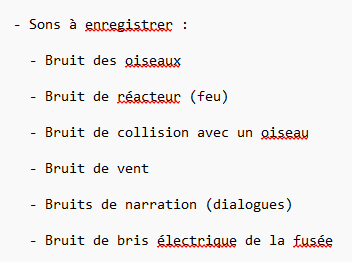
  
#### Mardi

- Discuter de la planification prévue des tâches avec les professeurs.
- Corriger et ajuster la planification en fonction des conseils des professeurs.
  
#### Mercredi

- Enregistrer les sons manquants à l’aide de Sound Devices.

- Nettoyer les sons enregistrés pour les préparer à l’utilisation.

- Faire des recherches sur comment programmer et intégrer les sons dans Unity.

- Prendre des notes sur les méthodes et techniques pour l’intégration des sons.

  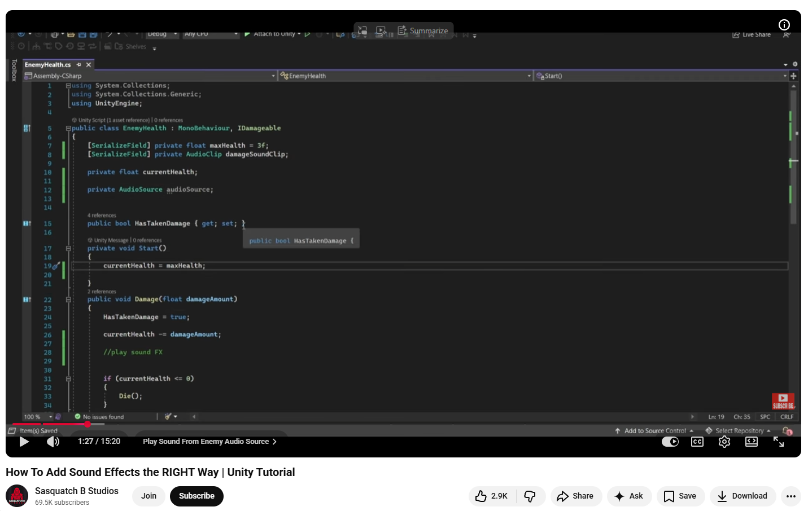
  
#### Jeudi

- Faire la modélisation 3D d’une mouette dans Maya 3D.
   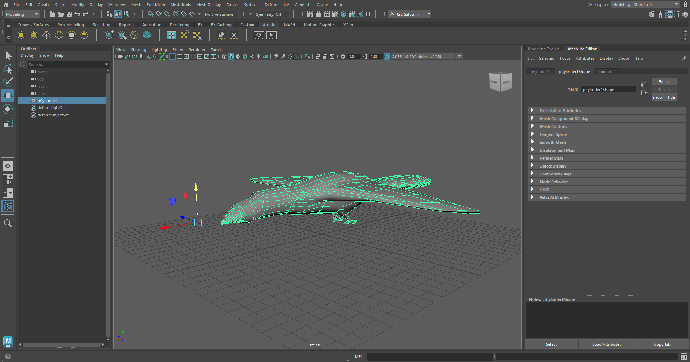

- Faire la modélisation 3D d’un avion commercial dans Maya 3D.
   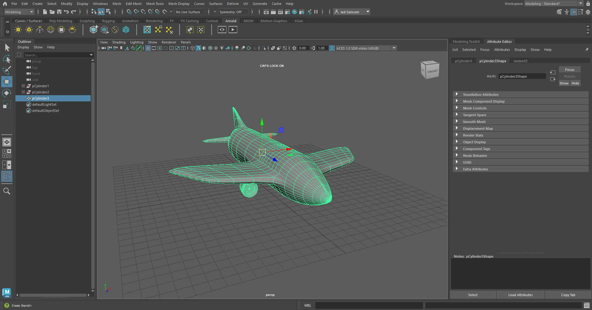

- Faire des recherches pour améliorer la précision et les détails des modèles 3D.

#### Vendredi

- Préparation des modèles 3D (mouette et avion commercial) en vue de leur intégration dans Unity.

- Vérification de l’échelle et de l’orientation des modèles pour éviter des problèmes à l’importation.

- Exportation des modèles au format FBX.
  
### Semaine 3

#### Lundi

- Prises de notes et organisation des éléments du projet.
- Préparation du matériel et planification des étapes pour l’intégration des effets sonores.

#### Mardi

- Intégration des effets sonores dans le prototype.
- Tests initiaux pour vérifier la réactivité des sons aux différentes entrées utilisateur.
  
#### Mercredi

- Poursuite de l’intégration des effets sonores dans le prototype.
- Tests et ajustements pour améliorer la réactivité sonore.
- Préparation d’un plan pour l’installation du projet prévue le lendemain.

#### Jeudi

- Réalisation de l’installation du projet.
- Mise en place des haut-parleurs en les fixant au plafond et en effectuant les connexions nécessaires pour assurer le bon fonctionnement des sons.
- Ajustement de la projection à l’aide du projecteur et mise en marche de celui-ci.
- Préparation générale du dispositif en vue de la porte ouverte.

#### Vendredi

- Aucun travail technique réalisé.
- Préparation et réflexion en lien avec la suite du projet.
  
### Semaine 4

#### Lundi

- Organisation de la semaine et planification des tâches à venir pour préparer la refonte des modèles 3D et les tests des projecteurs.
- Réflexion sur les retours de l’équipe et identification des priorités pour la suite du projet.
- Préparation du matériel et des outils nécessaires pour les travaux prévus plus tard dans la semaine.

#### Mardi

- Refonte complète des modèles 3D dans Maya 3D suite aux retours de l’équipe.
- Recréation complète du modèle 3D de la mouette en travaillant sur les proportions, les détails et la structure pour qu’il soit agréable visuellement.
- Recréation complète du modèle 3D de l’avion commercial en améliorant la précision et les détails pour répondre aux attentes de l’équipe.

#### Mercredi

- Attente de nouvelles directives de l’équipe avant de continuer les travaux.

#### Jeudi

- Recherche de solutions pour faire fonctionner les projecteurs afin d’afficher sur tout le mur en forme de cercle dans le grand studio.
- Étude des contraintes techniques liées à l’orientation, à la distance et à la couverture des projecteurs.
- Communication avec les professeurs et les TTP pour valider les paramètres techniques et obtenir des conseils sur l’installation.
- Mise en place de deux projecteurs sur les côtés pour tester la projection et observer le rendu sur le mur.
- Ajustement de l’alignement et de la position des projecteurs pour optimiser la couverture.
- Prise de notes sur les résultats des tests pour préparer la prochaine étape et décider du positionnement final des projecteurs.

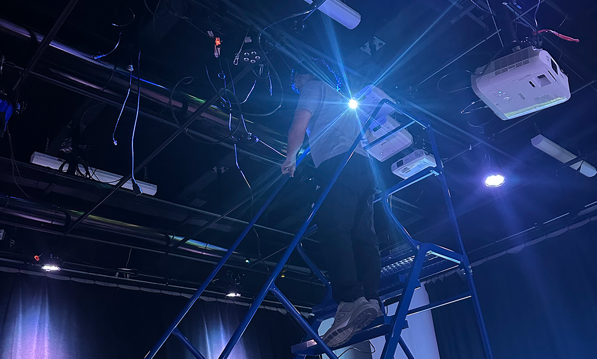

#### Vendredi

- Aucune activité supplémentaire à signaler.
  
### Semaine 5

#### Lundi

- Réflexion sur la façon de placer les projecteurs dans le grand studio.

- Analyse des différentes options pour optimiser la couverture du mur circulaire.

#### Mardi

- Poursuite du travail commencé en semaine 4 sur le positionnement des projecteurs dans le grand studio.

- Ajustement des hauteurs et des angles afin de trouver la configuration qui couvre le mieux le mur circulaire dans le grand studio.

- Après plusieurs essais, décision d’installer les projecteurs en configuration verticale, un au-dessus de l’autre.

- Placement du projecteur principal en bas, du deuxième au-dessus et du troisième encore plus haut.

- Ajout d’un espace entre chaque projecteur pour éviter tout risque de surchauffe ou de dommage.

- Vérification que la projection couvre l’ensemble du mur circulaire sans séparation visible entre les zones projetées.

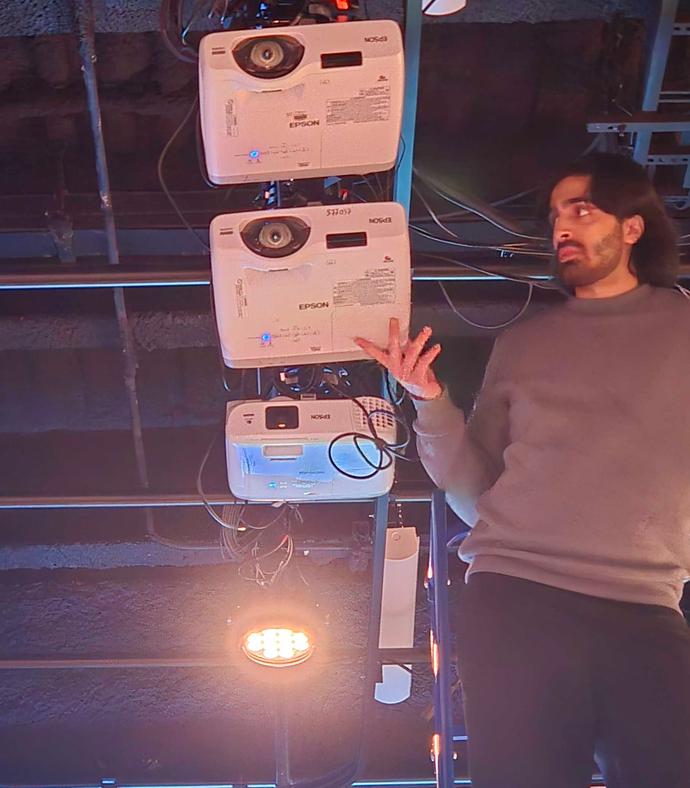

#### Mercredi

- Poursuite du positionnement des projecteurs pour confirmer la configuration finale.

- Mise en place des câbles réseau et d’alimentation pour que les projecteurs puissent fonctionner.

- Organisation et placement des fils de façon propre et sécurisée.

- Vérification que tout le câblage permet l’ouverture et l’utilisation des projecteurs sans gêne.

#### Jeudi

- Vérification du fonctionnement du réseau des projecteurs pour pouvoir les ouvrir depuis l’ordinateur, sans avoir à utiliser l’échelle ni appuyer sur les boutons des projecteurs.

- Installation des haut-parleurs à côté du mur circulaire.

- Placement et organisation des câbles pour les haut-parleurs.

- Connexion des haut-parleurs afin qu’ils soient opérationnels pour le projet.

- Discussion avec les équipes sur ce qui manque pour la maquette 2 prévue mardi.

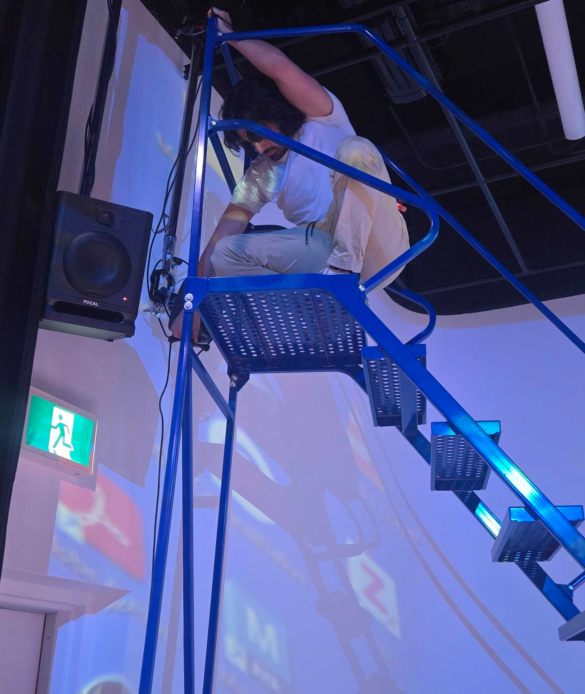

#### Vendredi

- Aucune activité technique réalisée.

- Réflexion sur la suite du projet.

### Semaine 6

#### Lundi

- Intégration des sons dans Unity à l’aide de composants AudioSource.

- Configuration du déclenchement sonore lors de l’appui sur un bouton.

- Activation d’effets sonores lors des collisions entre objets.

- Tests des interactions pour vérifier que les sons se jouent au bon moment.

- Ajustements pour éviter les déclenchements involontaires ou les répétitions.

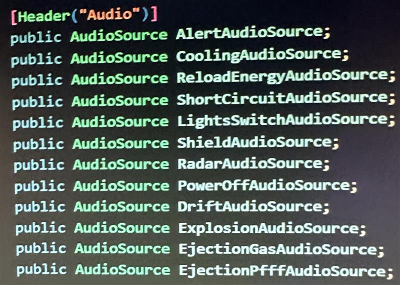

#### Mardi

- Nettoyage complet de notre espace dans le grand studio pour la présentation de la maquette 2 prévue le midi.

- Organisation et remise en ordre de l’installation pour que tout soit propre et présentable.

- Vérification du bon fonctionnement des projecteurs et des haut-parleurs avant la présentation.

- Présentation de la maquette 2 durant le dîner.

- Réception des commentaires du professeur sur notre projet, pour identifier les points à améliorer.

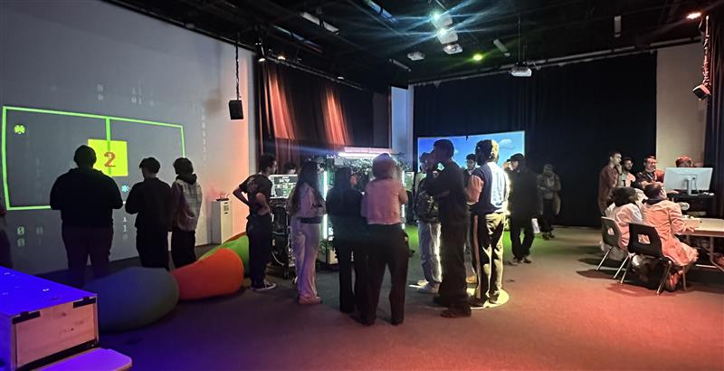

#### Mercredi

- Discussion avec l’équipe sur les tâches restantes et la partie Ethernet à préparer.

- Recherche sur le mapping des projecteurs pour comprendre comment adapter la projection au mur circulaire et anticiper les étapes techniques.

- Observation et prise de notes sur les contraintes techniques et le workflow pour les prochaines interventions.

#### Jeudi

- Tentative de mapping des projecteurs afin d’adapter l’affichage au mur circulaire du studio. J’ai fait plusieurs essais pour comprendre la logique de projection et l’alignement, mais c’est finalement mon collègue qui a réalisé le mapping final.

- Observation de la configuration des composantes M5Stack Atom via câble Ethernet. Le professeur souhaitait initialement connecter une seule composante, mais des problèmes liés au code sont apparus. Il a donc procédé lui-même à la configuration complète des trois connexions Ethernet pour assurer le bon fonctionnement du système.

- Même si je n’ai pas effectué les connexions moi-même, j’ai pu observer le processus et mieux comprendre la logique du branchement et de la communication réseau.

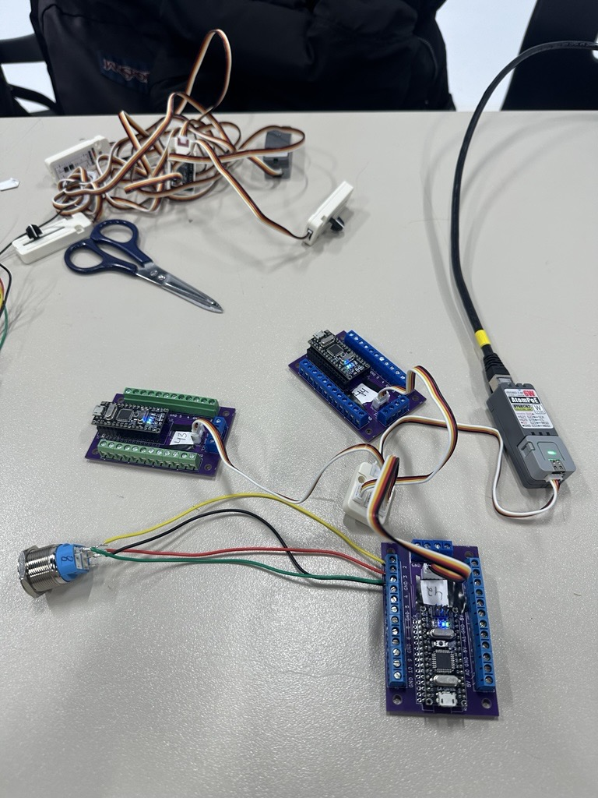

#### Vendredi

- Aucune intervention technique, mais prise de recul sur le projet et réflexion sur les prochaines étapes : optimisation de l’installation, vérification du son et préparation pour la suite.

### Semaine 6.5

#### Lundi

- Aucune activité technique réalisée.

- Réflexion sur la suite du projet et préparation pour la finalisation.
  
#### Mardi

- Collecte des sons restants nécessaires pour le projet.

- Organisation des fichiers audio pour préparer leur utilisation dans le jeu.

- Vérification du niveau sonore des sons pour s’assurer qu’ils sont assez forts et clairs.

- Préparation des sons afin de pouvoir intégrer ceux qui manquent dans la version finale du jeu avant la présentation finale.

#### Mercredi

- Installation des fils électriques pour les composantes du projet.

- Branchement des fils d’alimentation dans chacun des périphériques de l’installation.

- Vérification des couleurs des fils afin de les connecter correctement aux bonnes bornes dans chaque périphérique.

- Chaque périphérique contient 4 composantes de boutons, qui ont été reliées à l’alimentation.

- Mise en place de trois périphériques pour alimenter les différentes composantes du dispositif.

- Organisation des fils pour garder l’installation propre et sécurisée.

 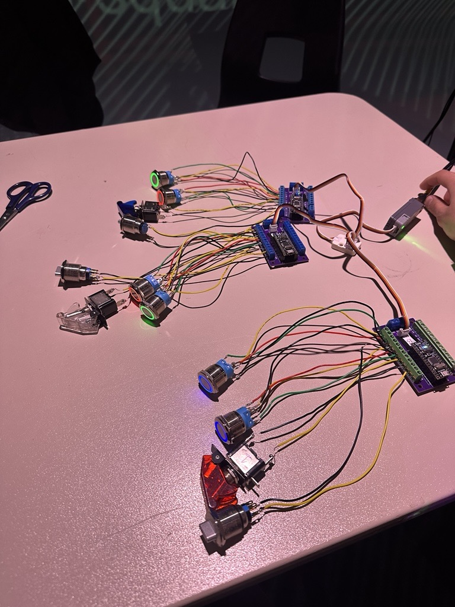
 
#### Jeudi

- Tentative de connexion Ethernet des faders Arduino en utilisant la méthode montrée par le professeur.

- Vérification du branchement : la connexion Ethernet semblait fonctionner puisque le voyant était vert.

- Essais pour manipuler les faders dans Pure Data afin de vérifier si les données étaient bien reçues.

- Plusieurs tests ont été faits pour comprendre pourquoi les faders ne répondaient pas dans Pure Data.

- Recherche de solutions et essais de différentes approches, mais le contrôle des faders dans Pure Data ne fonctionnait toujours pas.

#### Vendredi

- Aucune activité technique réalisée.

-Prise de recul et préparation mentale pour les tâches de la semaine.

### Semaine 7

#### Lundi

- Aucune activité technique réalisée sur le projet cette journée.
  
#### Mardi

- Tentative de mise en place de la connexion Ethernet pour les faders Arduino afin de permettre leur communication avec le système.

- Intégration de nouveaux sons dans le jeu avec Unity.

- Ajout du son d’ambiance de la Terre pour l’introduction, afin qu’il se joue au début du jeu lors du launch et du relaunch.

- Intégration du son de propulseur de la fusée dans l’animation : lorsque le feu de la fusée apparaît au début du décollage et aussi à la fin lors de l’atterrissage.

- Déplacement et ajustement des haut-parleurs pour s’assurer qu’il n’y ait pas d’ombre des haut-parleurs sur le mur rond du grand studio lors de la projection.

#### Mercredi

- Levée de cours en raison du verglas.

- Déplacement vers l’école impossible en raison des conditions météorologiques.

- Aucune activité technique réalisée sur le projet cette journée.

#### Jeudi

- Installation des composantes dans la boîte qui sert de tableau de bord du projet.

- Les composantes ont été placées dans les trous déjà présents sur la boîte pour pouvoir les fixer correctement.

- Branchement des fils des composantes aux trois périphériques du système.

- Vérification des branchements pour s’assurer que tout est bien connecté et sécuritaire, afin que la connexion Ethernet puisse fonctionner correctement.

 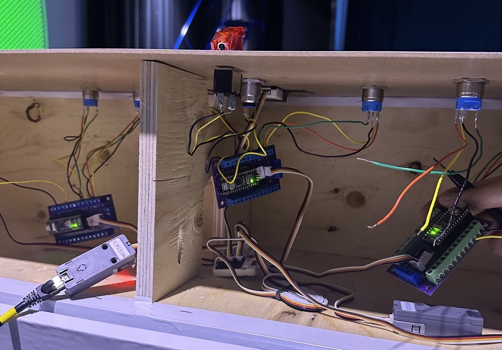 
 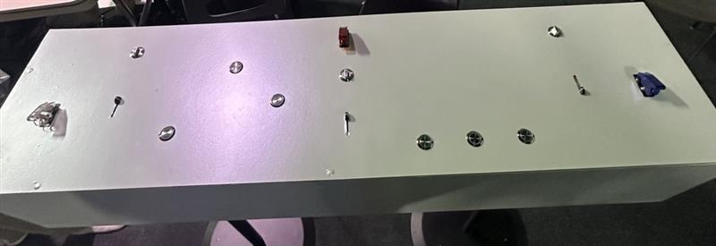

#### Vendredi

- Déplacement de l’ordinateur principal qui sera utilisé pour la présentation finale vers la salle de matrice.

- Mise en place du projet afin de pouvoir le faire fonctionner à partir de la salle de matrice.

- Vérification de l’installation du projet pour s’assurer que rien ne traîne et que tout est propre et sécuritaire.

-Tests des projecteurs et des haut-parleurs pour confirmer qu’ils fonctionnent bien en vue de la présentation finale.

### Semaine 8

#### Lundi

#### Mardi

#### Mercredi

#### Jeudi

#### Vendredi

