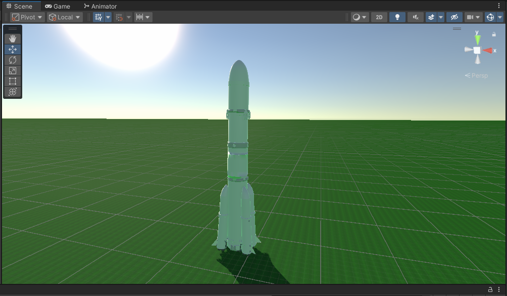
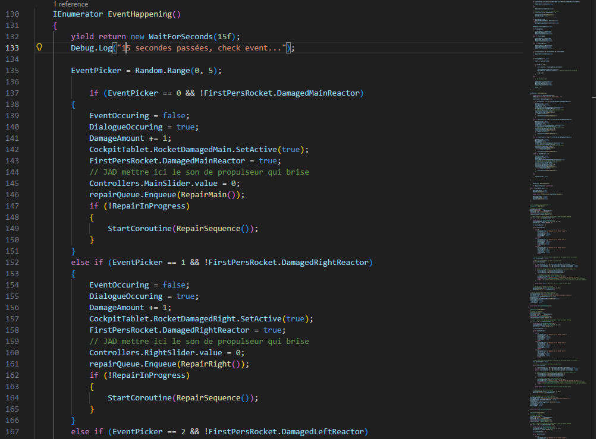
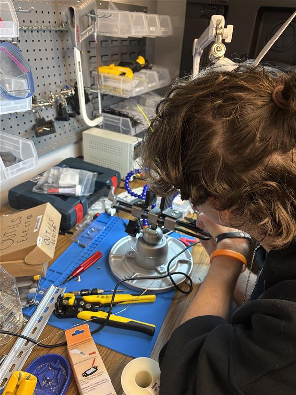

# Justin Montpetit

## Planification

Cette section, complétée lors de la première semaine, présente les tâches individuelles **hebdomadaires** prévues.

<!--
- Planification sur 9 semaines (8 semaines de cours et 1 semaine de rattrapage) présentant les tâches individuelles hebdomadaires prévues.
- Au moins une tâche par semaine. Les tâches ne peuvent pas se répéter et doivent être suffisamment précises.
- Les tâches doivent être cohérentes avec celles des autres membres de l’équipe et avec le concept du projet, et être mises à jour en continu.
- Critères :
    - Intention et concept clairs
    - Description approfondie de la conception sonore et visuelle
    - Planification détaillée du contenu multimédia à intégrer
    - Planification technique rigoureuse
-->

### Semaine 1

- Corriger le site web et ajout des nouvelles sections.
- Préparation au projet final.

### Semaine 2

- Commencer à coder la séquence d'urgence (réacteur endommagé)
- Commencer à coder la séquence d'urgence (Communications avec la tour de contrôle)

### Semaine 3

- Compléter les séquences d'urgences si elles ne l'est pas (jeu).
- compléter de coder la séquence d'urgence (réacteur endommagé)
- compléter de coder la séquence d'urgence (Communications avec la tour de contrôle)
- Commencer à coder la séquence d'urgence (réparations après colision)
- Commencer à coder la séquence d'urgence (Radar endommagé)
- Commencer à coder la séquence d'urgence (réajuster la trajectoire) 

### Semaine 4

- commencez à coder la section du détâchement / atterissage de la navette sur mars (jeu).
- Compléter les événements aléatoires si ils ne le sont pas.
- Commencer à préparer les matériaux nécessaires pour la construction du panneau de contrôle.
- Commencer à construire le panneau de bord.

### Semaine 5

- Compléter la section du détâchement si elle ne l'est pas (jeu).
- Assembler les pièces du tableau de bord.
- Perçage de trous dans le tableau de bord.
- Ajout de la trappe dans le tableau de bord.
- Optimiser les UI (jeu).

### Semaine 6

- Corriger les problèmes / bugs possible dans l'expérience.
- Test de l'expériences avec les composantes du tableau de bord.

### Semaine 6.5

- Corriger les problèmes / bugs possible dans l'expérience.
- Ajouter des dialogues dans l'expérience. (si nécessaire)

### Semaine 7

- Corrections de problèmes / bugs possibles dans l'expérience.

### Semaine 8

- Vernissage et dernières retouches nécessaires à l'exposition

## Journal de bord

Cette section, complétée **quotidiennement** pendant l’exécution du projet, documente le travail individuel réellement réalisé chaque jour.

<!--
- Une entrée par jour sur 8 semaines (8 semaines à partir de la semaine 2).
   - Un total d'au moins 40 entrées uniques!
- Chaque jour :
    - Documentstion visuelle et/ou sonore du travail effectué
    - Lien vers les billets GitHub résolus
- Démarche rigoureuse de validation de la qualité
- Démonstration d'autonomie.
- Exécution technique précise et complète.
- Évaluation réfléchie de la contribution individuelle au travail d’équipe.
-->

### Semaine 2

#### Lundi

- Début de la programmation test (première personne)

#### Mardi

- réglage de problèmes liés aux modèles 3D .Blend
- Optimisation de la Minimap
- Ajout d'un modèle 3D placeholder de Mars dans la scène 2 (espace)

#### Mercredi

- Remplacement des fichiers .Blend par des .FBX
- Réglage de problèmes de physique dans la scène 1 (décollage)
- Ajout d'un background spatial dans la scène 2 (espace)
- Ajout des sliders et UI placeholders dans la scène 2
- commencement du système de physique/déplacement dans la scène 2

#### Jeudi

- Ajout de météore dans la scène 2 (obstacle)
- Ajout de la Minimap dans la scène 2
- Commencement de la programmation du système d'événements aléatoires

#### Vendredi

- Changement du système d'événements aléatoires pour faciliter l'implémentation des boutons
- Correction de problèmes de boucles infinies dans la scène 2 (espace)
- Complétion du système de séquence d'urgence des réacteurs
- Complétion de la séquence d'urgence réacteur principal & droit

### Semaine 3

#### Lundi

- système de séquences d'urgence (réacteur) complété (reste le réacteur gauche)
- Révision du système d'urgence pour faciliter la tâche lors de l'implémentation des boutons physiques
- Corrections de problèmes de boucles infinies

#### Mardi

- Ajout des premiers éléments d'UI
- Ajout de la séquence d'urgence du réacteur gauche
- Ajout d'un visuel de la vitesse de la fusée (scène 2)
- Ajout d'UN visuel de la distance restante entre Mars et la fusée (scène 2)
- Soudure des boutons

#### Mercredi

- ajustements des éléments d'UI
- Ajout d'astéroïdes dans la scène 2 (obstacles)

#### Jeudi

- Ajout des éléments de UI nécessaire pour la démo
- corrections finales du "Merge" entre ma branche et la branche d'Ahmed afin de faire fonctionner l'OSC

#### Vendredi

- Réflexion sur les commentaires

### Semaine 4

#### Lundi

- Attente de nouvelles directives & corrections de bugs

#### Mardi

- Soudure du Arduino
- Réflexion sur de meilleurs éléments de gameplay plus concrets

#### Mercredi

- Début de nouvelles images pour le scénarimage (actions effectuées par les boutons)
- Intégration des modèles 3D réel

#### Jeudi

- Refonte du scénarimage pour mieux convenir à l'expérience réelle qui sera produite.

#### Vendredi

- Ajout de la jauge de chaleur
- Ajout de la jauge d'énergie
- Ajout de la lumière ajustant la visibilité
- Ajout de la fonction "drift"
- Ajout de la fonction "Refroidissement du moteur"
- Ajout de la fonction "rechargement d'énergie"
- Correction de problématiques avec certains scripts
- Retrait "potentiellement temporaire" du script d'événements aléatoires

### Semaine 5

#### Lundi

- Ajout de tout les boutons + sont fonctionnels
- Ré-ajout du système de "réparation" des propulseurs (boutons 4-5-6)
- Ajout du bouclier
- Ajout de la nouvelle "minimap" désormais appelée "Radar"
- Création d'un script entièrement dédié aux boutons et sliders pour faciliter l'implémentation future du Arduino.
- Ajout des collisions (non complété)
- Corrections et ajustement des UI qui n'étaient pas centrés
- Ajustement de la force des propulseurs lorsqu'ils sont défectueux (force de 0.4f au lieu de 0)

#### Mardi

- Ajout des bons modèles 3D d'astéroïdes
- Ajout des bonnes textures
- Ajout des collisions avec tout les obstacles possibles
- Ajout d'un effet de destruction (particules) lors d'une collision avec un astéroïde
- Ajout du nouveau modèle 3D de cockpit + écran UI situé à l'intérieur
- Ajout des UI respectifs pour chacune des jauges (Chaleur & Énergie)
- Ajout des modèles 3D du corps et la tête de la fusée
- Changement du modèle 3D de la planète étrangère
- Soudure des trois boutons poussoirs
- Changement des ports OSC (export vers un seul port plutôt qu'un par Arduino)
- Ajout de certains UI à l'intérieur du cockpit sur la tablette

#### Mercredi

- Ajout de possibilité de plusieurs parties de la fusée brisée en même temps
- Ajout du UI de barre de vie
- Ajout du UI du réel tableau de bord
- Ajout du UI de fusée + partie de fusée opérationnelle ou non
- Ajout d'une animation de rotation aléatoire sur les astéroïdes
- Corrections de problèmes d'affichage reliés aux événements aléatoires

#### Jeudi

- Ajout de l'explosion lorsque la vie atteint 0
- Ajout d'une barre de vie qui répond aux dégâts
- Ajout de l'éjection lors du flip switch rouge
- Correction de problème de disposition lorsque la fusée était trop loin
- Ajout des switch qui désactivent les réacteurs
- Ajout de l'événement "moteur brisé" dans les événements aléatoires

#### Vendredi

- Ajout d'un fonctionnement empêchant le joueur de maintenir "refroidissement" et "rechargement" en même temps
- Complétion du système d'éjection

### Semaine 6

#### Lundi

- Complétion du système GameOver/Explosion
- Corrections de problèmes de caméra et fonctionnements (culling mask + DamagedEngine)
- Correction d'un problème avec le bouclier (ne se désactivait pas lorsque l'énergie atteignait 0)

#### Mardi

- Ajout de multiples obstacles pour ajouter de la difficultée
- Ajout de lignes de commentaires pour indiquer à mes coéquipiers où mettre les sons
- Correction de l'UI barre de dialogue

#### Mercredi

- Mise à jour du modèle 3D cockpit pour un modèle ayant un plus grand dashboard.
- Commencement d'une fonctionnalité de boost pour remplacer la fonctionnalité de drift.
- Implémentation de nouveaux îcones UI pour mieux indiquer les problèmes présent dans la fusée.

#### Jeudi

- UI du tableau de bord (témoins lumineux) fonctionnels
- Lors du game Over, Astronaute catapulté

#### Vendredi

- Modifications de plusieurs variables permettant de rendre le jeu plus accessible à tous (facilité)
- Changement des variables pour les événements aléatoires afin de les rendre plus simple.
- Complétion du changement drift -> boost

### Semaine 6.5

#### Lundi

- Ajout de la vélocité (vitesse qui s'accumule sans arrêt)
- Fix du problème d'affichage de vitesse (0 lorsque la fusée bougeait)
- Complétion de l'animation de l'astronaute éjecté lorsque la partie est perdue (rotation aléatoire)

#### Mardi

- Ajout de l'éjection dans scène 1
- Ajout des textures dans scène 1
- Retrait des obstacles temporaires scène 1

#### Mercredi

- Ajout des nouveaux UI dans scène 2
- Correction des UI problématiques dans scène 2

#### Jeudi

- Travail sur la scène 1 (n'a pas abouti)

#### Vendredi

- Commencement des zones de vents dans la scène 1
- Corrections de bugs dans la scène 1

### Semaine 7

#### Lundi

- Aucun travail effectué

#### Mardi

- 1/2 des zones de vent fonctionelles.
- Modification du script Zones et ajout d'un nouveau script WindZones

#### Mercredi

- Ajout de l'écran 100% fonctionnels des réparations
- Ajout des zones de limites dans la scène 2 (espace)

#### Jeudi

- Corrections des dialogues (redimensions & nouveaux textes)

#### Vendredi

- Ajout des zones fonctionnelles empêchant le joueur de sortir des limites
- Commencement de l'animation de décollage de la fusée.

### Semaine 8

#### Lundi

- Ajout d'une animation d'introduction (décollage)
- Ajout d'une animation d'outro (atterissage)
- Ajout d'un score final personnalisé
- Ajout de transitions entre chaque scènes
- Correction d'un problème de liaison avec le bouton tournant du boost
- Correction des UI affichés à l'écran
- Correction d'un problème d'affichage avec les boutons de réparation sur le UI
- Arrondissement du score final pour avoir un chiffre toujours positif
- Correction du problème OSC empêchant le build de fonctionner
- Correction des problèmes de fade qui ne couvrent pas toute l'espace
- Cache le UI lors de l'éjection
- Correction du problème de son lors de l'activation du bouclier (il rejouait sans cesse ne laissant pas écouter le vrai son)
- Ajout de plus d'obstacles et décorations
- Corrections de nombreuses valeurs influençant la difficulté
- Ajout des fades manquants
- Ajout d'une durée passée dans l'espace, ajoutée au score final pour un score + personnalisé

#### Mardi

- Aucun travail effectué

#### Mercredi

- Aucun travail effectué

#### Jeudi

- Présent à l'école pour répondre aux question / présenter le jeu

#### Vendredi

- Démontage de l'installation