# Thearylou Lach

## Planification

Cette section, complétée lors de la première semaine, présente les tâches individuelles **hebdomadaires** prévues.

<!--
- Planification sur 9 semaines (8 semaines de cours et 1 semaine de rattrapage) présentant les tâches individuelles hebdomadaires prévues.
- Au moins une tâche par semaine. Les tâches ne peuvent pas se répéter et doivent être suffisamment précises.
- Les tâches doivent être cohérentes avec celles des autres membres de l’équipe et avec le concept du projet, et être mises à jour en continu.
- Critères :
    - Intention et concept clairs
    - Description approfondie de la conception sonore et visuelle
    - Planification détaillée du contenu multimédia à intégrer
    - Planification technique rigoureuse
-->

### Semaine 1

- Mettre à jour le site Web.
- Recherche des composantes nécessaires.

### Semaine 2

- Déterminer les éléments 3D nécessaires à la progression.
- Produire modèle de la fusée
- Produire modèle du cockpit

### Semaine 3

- Adapter modèles pour maquette 1
- Produire modèles environnement de l'espace : météorite et capsule d'atterissage de fusée
- Produire des textures pour quelques modèles.

### Semaine 4
- Produire des textures pour toutes les modèles.
- Finaliser les modèles 3D

### Semaine 5

- Recherche des matériaux pour le tableau de commande
- Commencement de la construction du tableau de commande

### Semaine 6

- Optimiser modèles et animations pour maquette 2.
- Ajuster les modèles 3D après maquettes 2
- Faire le lien Ethernet des composantes et Unity

### Semaine 6.5

- Avancer sur le fonctionnement du lien Ethernet

### Semaine 7

- Finaliser la construction du tableau de commande
- Finaliser le fonctionnement Ethernet des composantes et du jeu

### Semaine 8

- Présentation du projet
- Finaliser la documentation

## Journal de bord

Cette section, complétée **quotidiennement** pendant l’exécution du projet, documente le travail individuel réellement réalisé chaque jour.

<!--
- Une entrée par jour sur 8 semaines (8 semaines à partir de la semaine 2).
   - Un total d'au moins 40 entrées uniques!
- Chaque jour :
    - Documentstion visuelle et/ou sonore du travail effectué
    - Lien vers les billets GitHub résolus
- Démarche rigoureuse de validation de la qualité
- Démonstration d'autonomie.
- Exécution technique précise et complète.
- Évaluation réfléchie de la contribution individuelle au travail d’équipe.
-->

### Semaine 2

#### Lundi

#### Mardi
- Approfondir le concept.
- Recherche des boutons et des interrupteurs.

#### Mercredi
- Mettre en jour le site Web.
- Recherche des matériaux et la constructions de notre installation.

#### Jeudi
- Modélisation du cockpit
- Essayer d'implémenter un shader à partir d'un tutoriel, mais je vais le   laisser tomber à caise de sa complication. [Vidéo du tutoriel](https://www.youtube.com/watch?v=gw31oF9qITw)

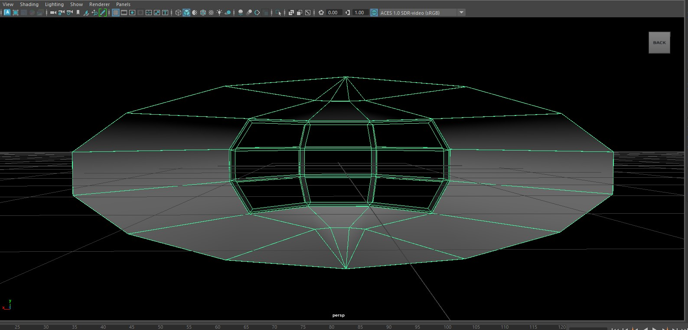

#### Vendredi
- Modélisation des modèles :  Fusée, astéorite et Mars.

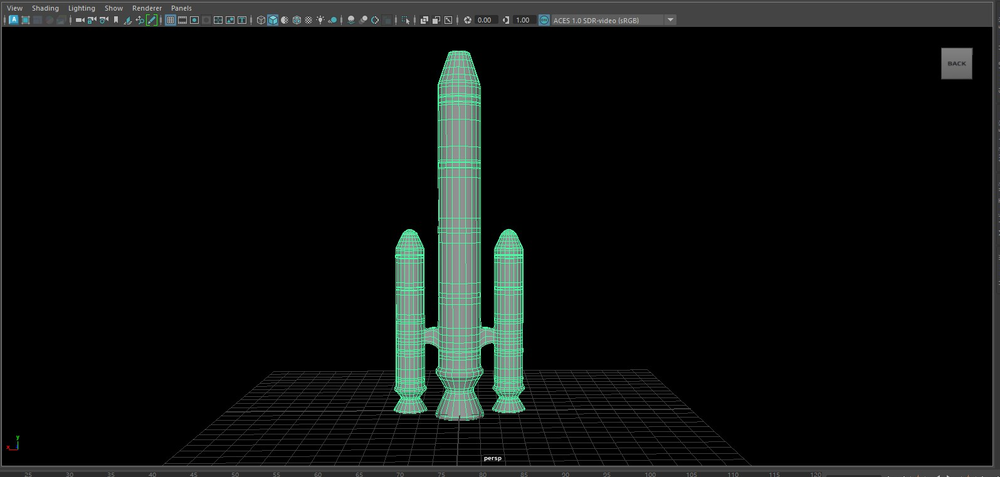
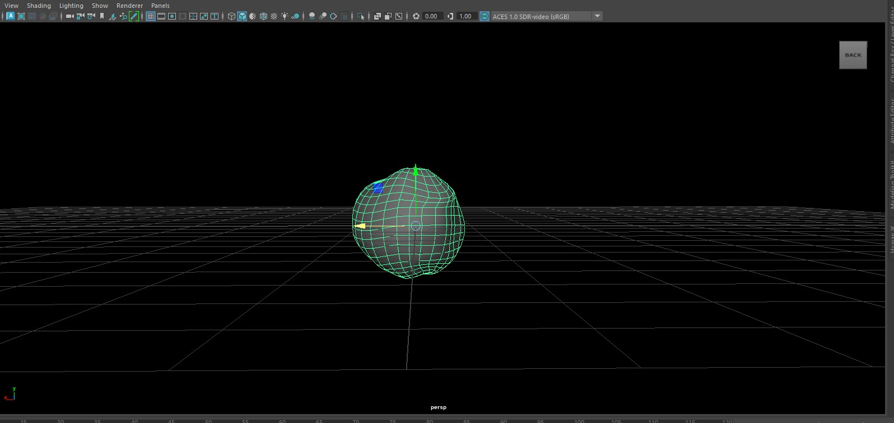

### Semaine 3

#### Lundi
 - Modélisation de la platforme d'atterissage sur Mars

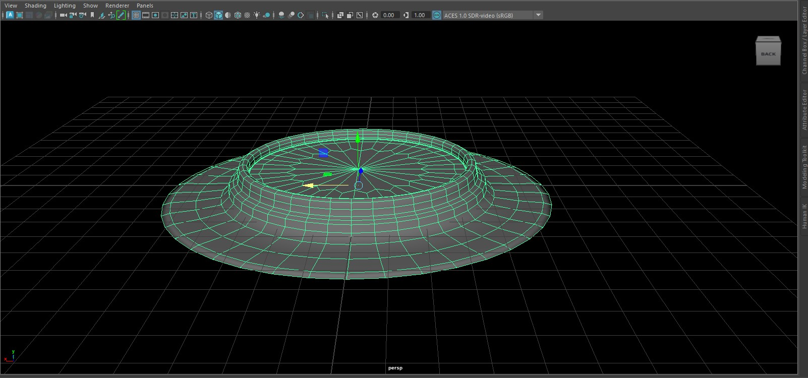

#### Mardi
- Chercher les pièces pour l'installation 
- Modélisation du bras de lancement
- Améliorer la modélisation de la fusée

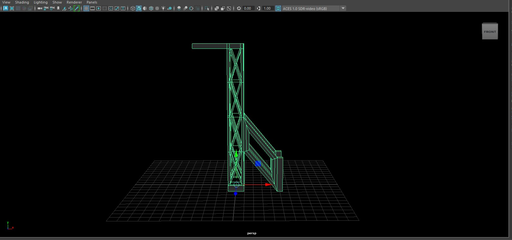
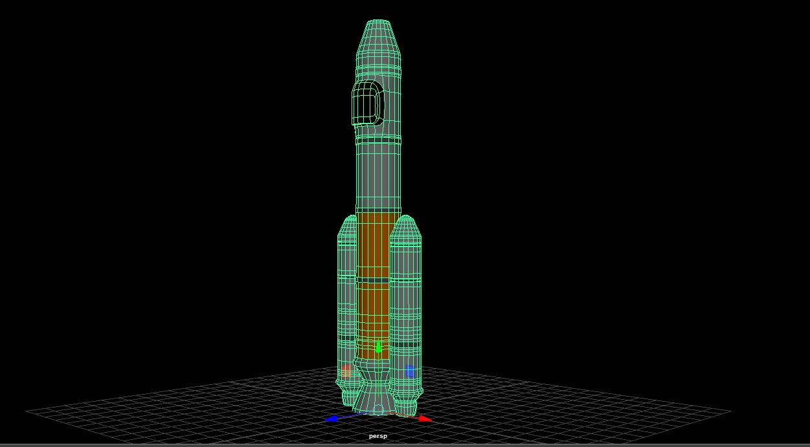

#### Mercredi
- Recherche sur quelle style de shader qu'on pourra utiliser sur unity.
- Faire plus de recherche sur les matériaux et les mesures de notre installation

#### Jeudi
- Recherche sur des programmes que je pourrais utiliser pour créer les textures comme par exemple texture ripper
- Créer la texture pour l'astéroide

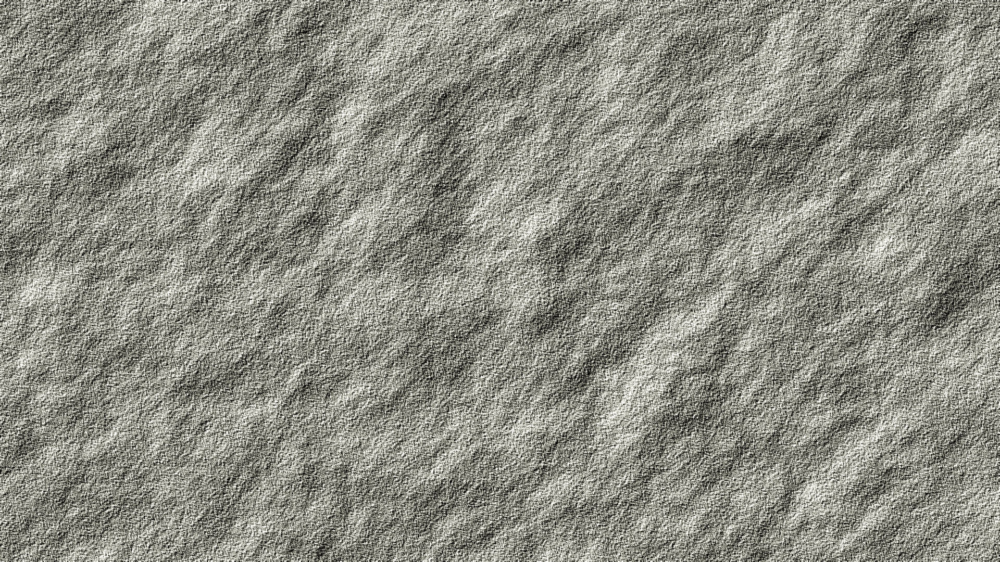

#### Vendredi
 - Création de la texture pour la planète

 
 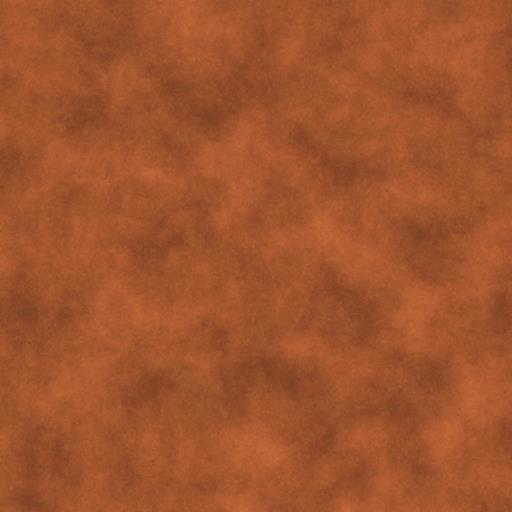
### Semaine 4

#### Lundi
- Créer d'autres modèles pour les astéroides
- Créer le modèle du terrain pour la planète

 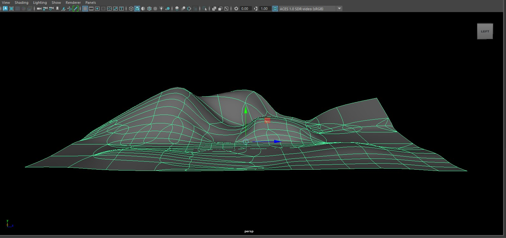
#### Mardi
- Amélioration du modèle du cockpit
- Créer une texture de métal, le béton et le terrain de mars
- Appliquer des shaders de Maya sur les modèles restants

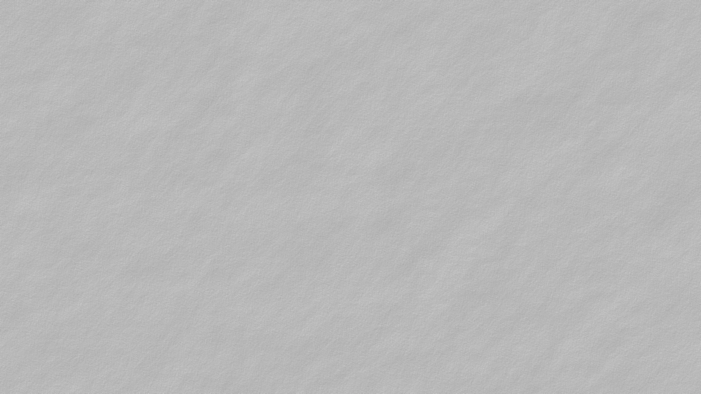
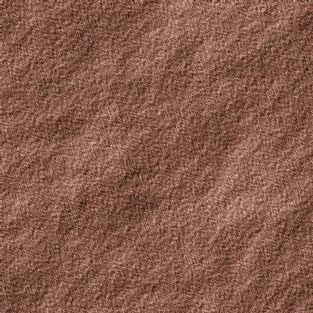

#### Mercredi
- Créer l'image pour le skybox de l'espace
- Appliquer les textures sur le modèles
- Discussion de notre scénarimage

 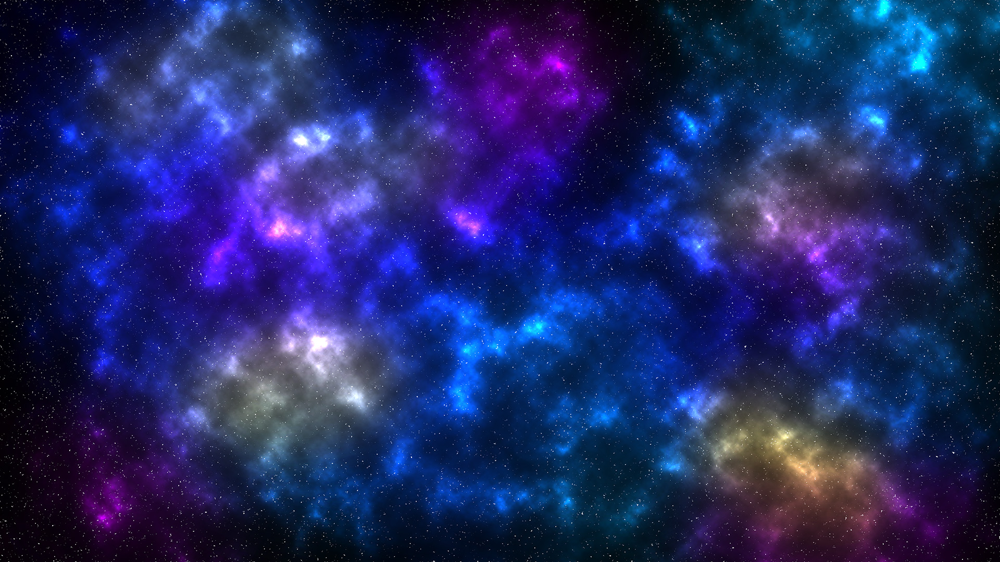

#### Jeudi
- Finaliser les modèles 3D
- Discussion de notre scénarimage

#### Vendredi
- Exporter tous les modèles en FBX

### Semaine 5

#### Lundi
- Recherche des matériaux spécifiques pour notre boite

#### Mardi
- Validation des mesures avec Radhouane de notre boite

#### Mercredi
- Prendre les mesures des composantes pour faire les trous sur notre tableau de commande
- Réaliser un schéma afin de faciliter le repérage des trous sur le tableau de commande

 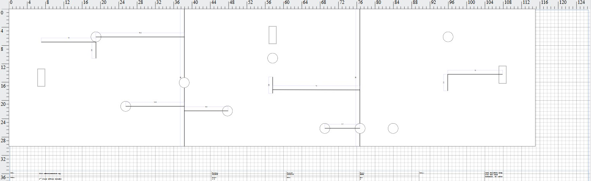

#### Jeudi
- Tracer les points de perçage sur le tableau de commande.
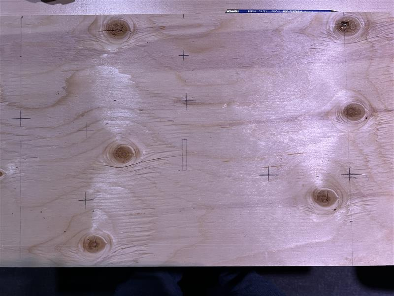

- Il sera nécessaire de changer la planche du tableau de commande, son épaisseur étant incompatible avec le fader

#### Vendredi
- Construire la boite

### Semaine 6

#### Lundi
- Apporter la boite à l'école et travailler sur la maquette 2

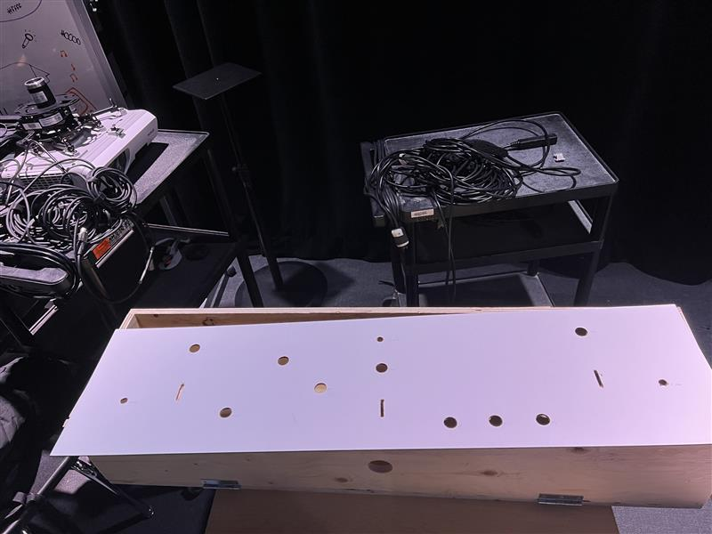

#### Mardi
- Assurer que la boite est bien placée sur la table
- Assurer que les boutons et les switches fonctionne bien

#### Mercredi
- Aggrandir l'écran du cockpit et ajouter un deuxième écran pour faire de la place pour le UI

#### Jeudi
- Observer et tenter de comprendre le code réalisé et les explications par le professeur pour la connexion Ethernet entre l’Atom et les Arduinos.

#### Vendredi
- Rechercher en ligne des matériaux pour la finition de la boîte.

### Semaine 6.5

#### Lundi

- Rien n'a été fait ce jour là

#### Mardi

- Transférer les codes de connexion Ethernet sur les trois Arduino Mini et les deux Atoms.
- Essayez de faire fonctionner la connexion Pure Data des faders, mais j’ai du mal à comprendre. Peut-être un problème de port.

#### Mercredi

- Essayer de faire fonctionner la connexion OSC sur Unity. Peut-être un problème de port.

#### Jeudi

 - Rien n'a été fait ce jour là

#### Vendredi

 - Rien n'a été fait ce jour là
 
### Semaine 7

#### Lundi

- Rien n'a été fait ce jour là

#### Mardi

- Avancer sur le fonctionnement de l'OSC
- Ajouter quelques lignes de code pour faire fonctionner les faders par Ethernet
- À l'aide du professeur, le Pure Data reçoit et envoit des données. Il fallait utiliser "oscformat -f i"
- Dans Unity, le "recever" doit avoir un port différent.

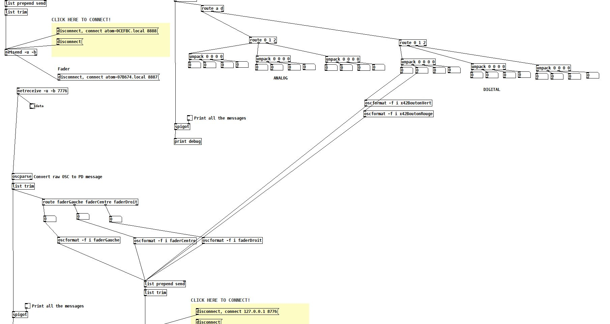

#### Mercredi

- Finir la  boîte

#### Jeudi

- Installation de la boîte et installation de ses composantes.
- Compléter le Pure Data pour que toutes les composantes envoient des données à Unity

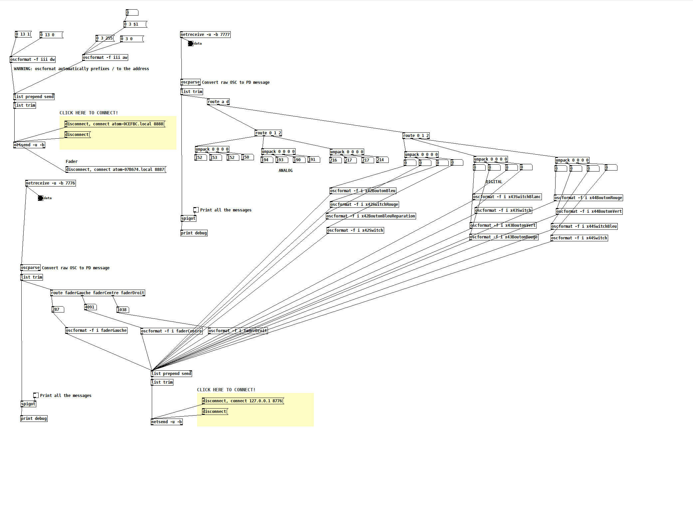

#### Vendredi

- Enregistrement de vidéos et d'audios
- Assurer que le projet fonctionne

### Semaine 8

#### Lundi
- Absent

#### Mardi
- Présentation aux élèves du TIM

#### Mercredi

 - Présent à l'école

 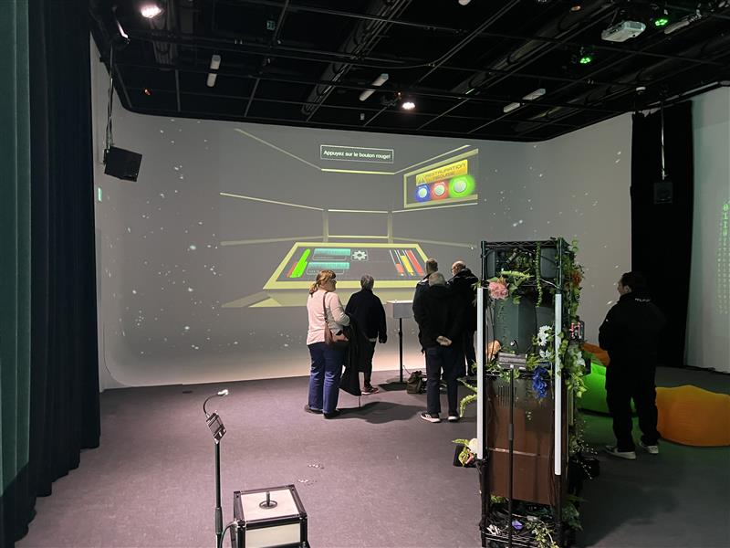

#### Jeudi

- absent

#### Vendredi

- Démontage

