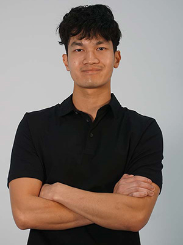

# Thearylou Lach

## Planification

Cette section, complétée lors de la première semaine, présente les tâches individuelles **hebdomadaires** prévues.

<!--
- Planification sur 9 semaines (8 semaines de cours et 1 semaine de rattrapage) présentant les tâches individuelles hebdomadaires prévues.
- Au moins une tâche par semaine. Les tâches ne peuvent pas se répéter et doivent être suffisamment précises.
- Les tâches doivent être cohérentes avec celles des autres membres de l’équipe et avec le concept du projet, et être mises à jour en continu.
- Critères :
    - Intention et concept clairs
    - Description approfondie de la conception sonore et visuelle
    - Planification détaillée du contenu multimédia à intégrer
    - Planification technique rigoureuse
-->

### Semaine 1

- Mettre à jour le site Web.
- Recherche des composantes nécessaires.

### Semaine 2

- Déterminer les éléments 3D nécessaires à la progression.
- Produire modèle de la fusée
- Produire modèle du cockpit

### Semaine 3

- Adapter modèles pour maquette 1
- Produire modèles environnement de l'espace : météorite et capsule d'atterissage de fusée
- Créer une animation simple pour la météorite.

### Semaine 4
- Produire des textures pour toutes les modèles.
- Produire des effets spéciaux pour la fusé et le cockpit.

### Semaine 5

- Appliquer matériaux/ textures optimisées.
- Ajouter effets visuels atmosphériques de l'espace.

### Semaine 6

- Optimiser modèles et animations pour maquette 2.

### Semaine 6.5

- Ajuster détails secondaires.
- Harmoniser avec interface et retours sonores.

### Semaine 7

- Tests de stabilité visuelle.

### Semaine 8

- Documenter modélisation + animation.
- Fournir rendus/captures.

## Journal de bord

Cette section, complétée **quotidiennement** pendant l’exécution du projet, documente le travail individuel réellement réalisé chaque jour.

<!--
- Une entrée par jour sur 8 semaines (8 semaines à partir de la semaine 2).
   - Un total d'au moins 40 entrées uniques!
- Chaque jour :
    - Documentstion visuelle et/ou sonore du travail effectué
    - Lien vers les billets GitHub résolus
- Démarche rigoureuse de validation de la qualité
- Démonstration d'autonomie.
- Exécution technique précise et complète.
- Évaluation réfléchie de la contribution individuelle au travail d’équipe.
-->

### Semaine 2

#### Lundi

#### Mardi
- Approfondir le concept.
- Recherche des boutons et des interrupteurs.

#### Mercredi
- Mettre en jour le site Web.
- Recherche des matériaux et la constructions de notre installation.

#### Jeudi
- Modélisation du cockpit
- Essayer d'implémenter un shader à partir d'un tutoriel, mais je vais le   laisser tomber à caise de sa complication. [Vidéo du tutoriel](https://www.youtube.com/watch?v=gw31oF9qITw)

#### Vendredi
- Modélisation des modèles :  Fusée, astéorite et Mars.

### Semaine 3

#### Lundi
 - Modélisation de la platforme d'atterissage sur Mars

#### Mardi
- Chercher les pièces pour l'installation 
- Modélisation du bras de lancement
- Améliorer la modélisation de la fusée

#### Mercredi
- Recherche sur quelle style de shader qu'on pourra utiliser sur unity.
- Faire plus de recherche sur les matériaux et les mesures de notre installation

#### Jeudi
- Recherche sur des programmes que je pourrais utiliser pour créer les textures comme par exemple texture ripper
- Créer la texture pour l'astéroide

#### Vendredi
 - Création de la texture pour la planète

 
 
### Semaine 4

#### Lundi
- Créer d'autres modèles pour les astéroides
- Créer le modèle du terrain pour la planète

 
#### Mardi
- Amélioration du modèle du cockpit
- Créer une texture de métal, le béton et le terrain de mars
- Appliquer des shaders de Maya sur les modèles restants

#### Mercredi
- Créer l'image pour le skybox de l'espace
- Appliquer les textures sur le modèles
- Discussion de notre scénarimage

 

#### Jeudi
- Exporter tous les modèles en FBX
- Discussion de notre scénarimage

#### Vendredi
- 

### Semaine 5

#### Lundi

#### Mardi

#### Mercredi

#### Jeudi

#### Vendredi

### Semaine 6

#### Lundi

#### Mardi

#### Mercredi

#### Jeudi

#### Vendredi

### Semaine 6.5

#### Lundi

#### Mardi

#### Mercredi

#### Jeudi

#### Vendredi

### Semaine 7

#### Lundi

#### Mardi

#### Mercredi

#### Jeudi

#### Vendredi

### Semaine 8

#### Lundi

#### Mardi

#### Mercredi

#### Jeudi

#### Vendredi

