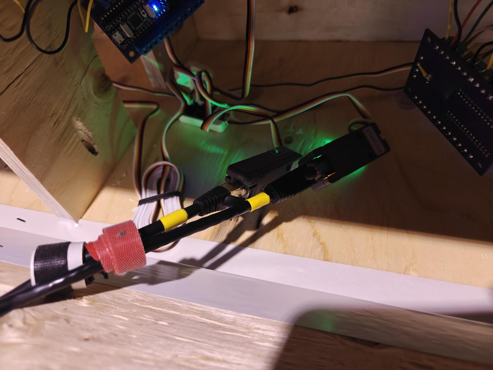
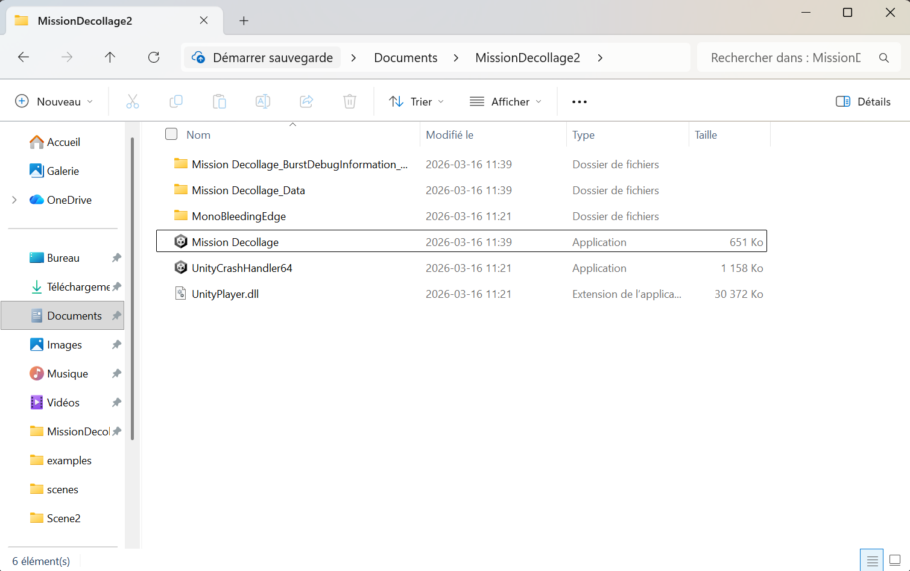
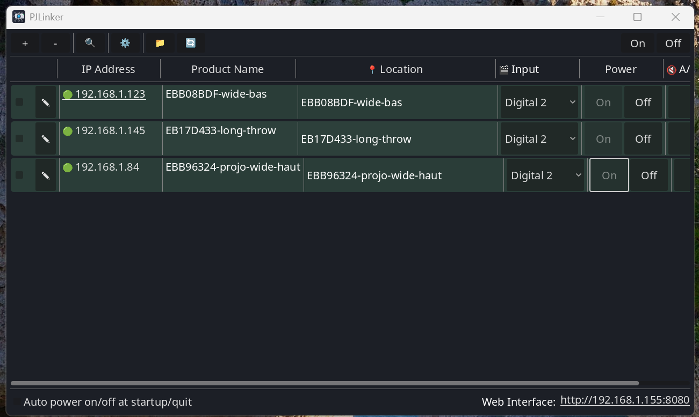
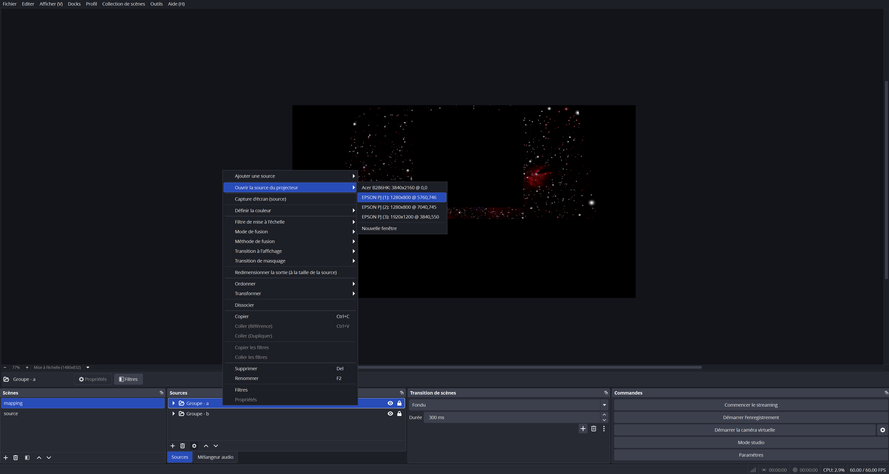
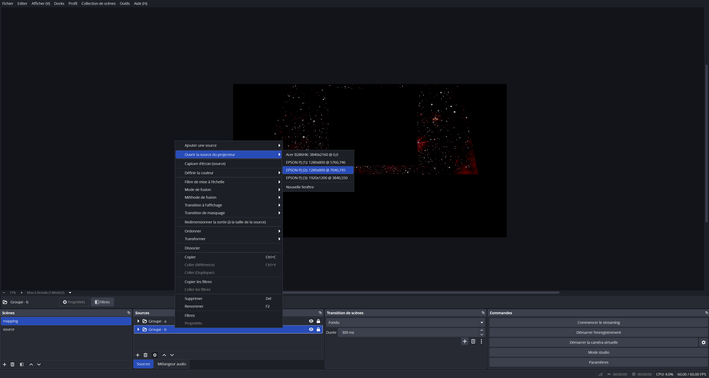

# Exposition

Cette section documente l'exposition publique du projet.

## Permanence

Ce tableau indique les responsables quotidiens de l’exposition, désignés par chaque équipe pour assurer la permanence pendant la semaine.

| Jour     | Responsable                              |
| -------- | ---------------------------------------- |
| Lundi    | Ahmed, Justin, Jad                       |
| Mardi    | Ahmed, Justin, Jad, Thearylou, Radhouane |
| Mercredi | Jad, Radhouane, Thearylou                |
| Jeudi    | Ahmed, Justin                            |
| Vendredi | Ahmed, Justin, Jad, Thearylou, Radhouane |

## Procédure d’ouveture quotidienne

Cette section décrit les étapes nécessaires pour ouvrir l’installation chaque matin.
Elle a pour objectif de garantir une mise en place cohérente, sécuritaire et fidèle au projet, quel que soit le responsable de permanence.

Tout d'abord, on branche les deux cables ethernet aux arduinos.

Par la suite, nous devons ouvrir le patch pure data et actionner manuellement la connection entre les différents arduinos au jeu.

Par la suite on lance l'exécutable du jeu.

Nous devons ensuite ouvrir les projecteurs avec l'utilitaire "PJLinker"

Sur OBS, nous devons ouvrir la source du premier projecteur ayant pour résolution 1280x800.

Enfin, nous faisons la même chose pour le second projecteur.

<!--
Chaque composante de l’installation est détaillée ci-dessous avec :
- une description,
- les étapes d'ouverture
- des liens utiles,
- des photos de référence.
-->

## Documentation vidéo finale

<!-- Intégration d’une vidéo : méthode 1 (vidéo hébergée sur YouTube, pouvant être non répertoriée publiquement)
-->

