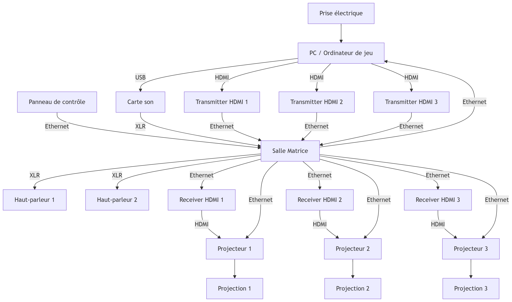

# Maquette (faisabilité)

## Scénarisation

---

## Scene 1

| Verbe action  | Condition de déclenchement                                                              | Effet visuel                                      | Effet sonore             | Effet interactif                          |
| ------------- | --------------------------------------------------------------------------------------- | ------------------------------------------------- | ------------------------ | ----------------------------------------- |
| **Installer** | Les interacteurs s’installent sur les chaises et mettent les écouteurs                  | La scène sélection de menu est affichée (pas sûr) | Musique de la scène menu | Aucun ou immersion dans l’ambiance        |
| **Appuyer**   | Les interacteurs appuient sur un bouton pour commencer le jeu et recevoir les instructions | Transition de scène                               | Son de confirmation      | Passage vers la scène instructions ou jeu |

---

## Scene 2

| Verbe action | Condition de déclenchement                        | Effet visuel                                                                 | Effet sonore                                                                                         | Effet interactif                                                |
|--------------|---------------------------------------------------|------------------------------------------------------------------------------|--------------------------------------------------------------------------------------------------------|-----------------------------------------------------------------|
| **Observer** | Les joueurs ont démarré le jeu                    | Un tutoriel est affiché à l’écran, indiquant les étapes pour utiliser la fusée | Sons d’environnement terrestres, voix de tutoriel, petite musique d’ambiance                         | Les joueurs sont invités à tester leur pouvoir sur la fusée     |
| **Écouter**  | Les joueurs ont démarré le jeu                    | Un tutoriel est affiché à l’écran indiquant les étapes à suivre              | Sons du tutoriel pour reconnaître les différentes alertes, sons d’environnement, petite musique       | Les joueurs doivent écouter et distinguer les sons d’alerte     |

---

## Scene 3

| Verbe action  | Condition de déclenchement | Effet visuel                                                | Effet sonore                                                                 | Effet interactif                                                                   |
|---------------|----------------------------|-------------------------------------------------------------|-------------------------------------------------------------------------------|------------------------------------------------------------------------------------|
| **Manipuler** | Les joueurs ont décollé    | Vue 3ᵉ personne de la fusée                                 | Réacteurs, fusée, débris terrestres, communications tour de contrôle         | Manipuler bouton et angle pour diriger la fusée vers sa destination                |
| **Écouter**   | Les joueurs ont décollé    | Vue 3ᵉ personne de la fusée                                 | Réacteurs, fusée, débris terrestres, communications tour de contrôle         | Écouter les alertes pour détecter un éventuel problème avec la fusée               |

---

## Scene 4

| Verbe action | Condition de déclenchement            | Effet visuel                                                                 | Effet sonore                              | Effet interactif                                     |
|--------------|---------------------------------------|------------------------------------------------------------------------------|--------------------------------------------|------------------------------------------------------|
| **Se lever** | Les joueurs ont réussi ou échoué le jeu | Vue 3ᵉ personne de la fusée atterrissant à destination ou détruite (game over) | Sons de festivité ou de découragement      | Aucune, sauf appuyer pour rejouer                   |

---

## Équipements

- Carte son
- Projecteur
- 4 chaises
- 4 écouteurs
- Ordinateur
- 4 contrôleurs Arduino

---

## Logiciels

- Unity
- Pure Data
- VS code
- Maya/Blender

---

## Synoptique

---

## Plan d’implantation

---

## Liste

- Ordinateur – x1  
- Chaise avec accoudoir – x4  
- Haut-parleur  
- Epson PowerLite 1980OWU Projector – x1  
- [PBHUB] I/O Hub 1 to 6 Expansion Unit (MEGA328) – x1  
- Contrôleur Arduino M5Stack ATOM Lite ESP32 – x4  
- Encodeur – x4  

## Budget

Voici ton tableau corrigé sans les liens :

| Composant | Prix réel (unité) | Prix réel total (CAD) | Prix attendu | Prix attendu réel (CAD) |
|-----------|-------------------|-----------------------|--------------|-------------------------|
| Ordinateur - x1 | 500 CAD | **500 CAD** | 0 CAD (emprunt école) | **0 CAD** |
| Chaise avec accoudoir - x4 | 20–60 CAD | **60-240 CAD** | 60-240 CAD | **60-240 CAD** |
| Haut parleur |  | | 0 CAD (emprunt école) | **0 CAD** |
| Epson PowerLite 1980OWU Projector - x1 | 1,844 USD ≈ 2,580.74 CAD | **2,580.74 CAD** | 0 CAD (emprunt école) | **0 CAD** |
| [PBHUB] I/O Hub 1 to 6 Expansion Unit (MEGA328) - x1 | 9.95 USD ≈ 13.6 CAD | **13.6 CAD** | 0 CAD (emprunt école) | **0 CAD** |
| Contrôleur Arduino M5Stack ATOM Lite ESP32 - x4 | 7.50 USD ≈ 10.3 CAD unité | **41.2 CAD** | 0 CAD (emprunt école) | **0 CAD** |
| Encodeur - x4 | $7.95 USD ≈ 10 CAD unité | **40 CAD** | 0 CAD (emprunt école) | **0 CAD** |
