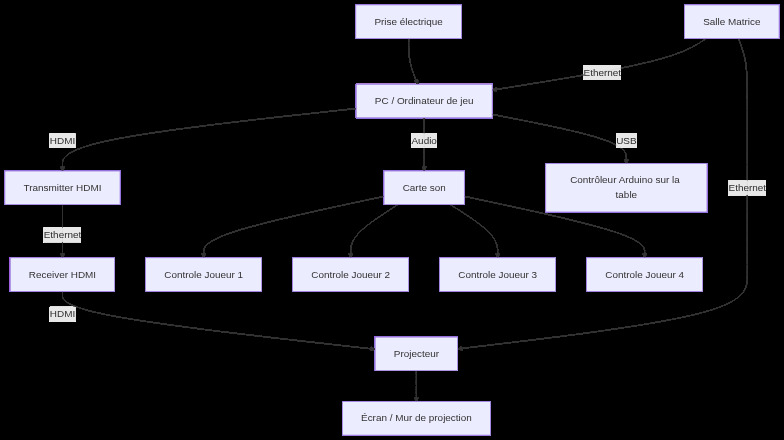
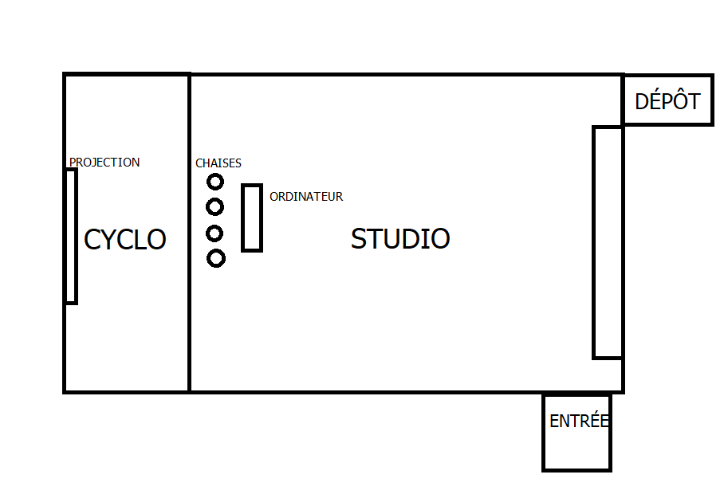
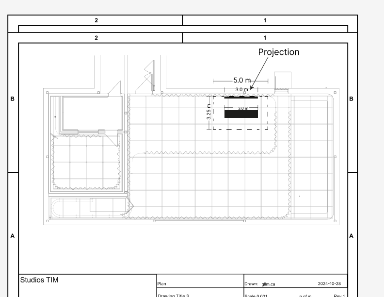
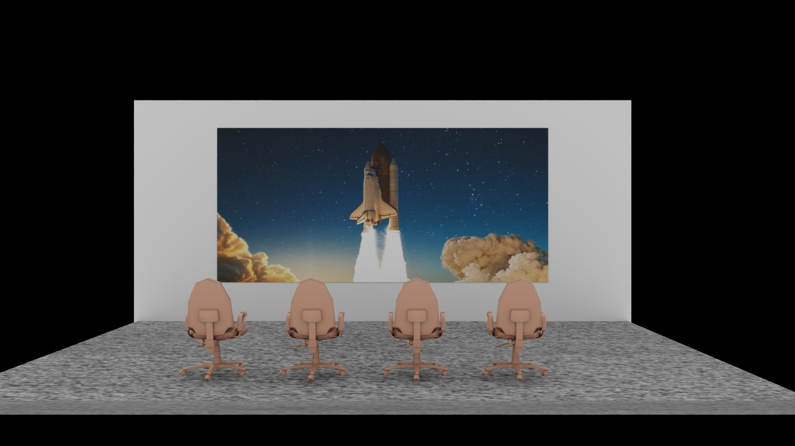
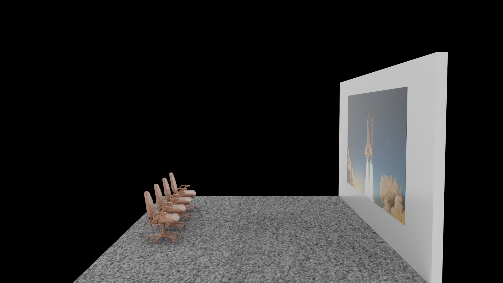
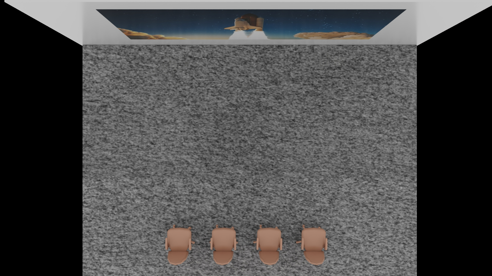

# Maquette (faisabilité)

## Scénarisation

## Scene 1

| Verbe action  | Condition de déclenchement                                                                 | Effet visuel                                      | Effet sonore             | Effet interactif                          |
| ------------- | ------------------------------------------------------------------------------------------ | ------------------------------------------------- | ------------------------ | ----------------------------------------- |
| **Installer** | Les interacteurs s’installent sur les chaises et mettent les écouteurs                     | La scène sélection de menu est affichée (pas sûr) | Musique de la scène menu | Aucun ou immersion dans l’ambiance        |
| **Discuter** | Les interacteurs communiquent sur ce qu'ils percoivent, ce qu'ils vont faire, sur quoi appuyer                     | La scène sélection de menu est affichée | Musique de la scène menu | Création d'une stratégie d'équipe ou une entente à l'égard du jeu        |
| **Appuyer**   | Les interacteurs appuient sur le bouton pour commencer le jeu et recevoir les instructions | Transition de scène                               | Son de confirmation      | Passage vers la scène instructions ou jeu |

---

## Scene 2

| Verbe action | Condition de déclenchement     | Effet visuel                                                                   | Effet sonore                                                                                    | Effet interactif                                            |
| ------------ | ------------------------------ | ------------------------------------------------------------------------------ | ----------------------------------------------------------------------------------------------- | ----------------------------------------------------------- |
| **Observer** | Les joueurs ont démarré le jeu | Un tutoriel est affiché à l’écran, indiquant les étapes pour utiliser la fusée | Sons d’environnement terrestres, voix de tutoriel, petite musique d’ambiance                    | Les joueurs sont invités à tester leur pouvoir sur la fusée |
| **Tester** | Les joueurs doivent suivre des étapes | Vue 3ᵉ personne de la fusée | Son du tutoriel pour capter l'attention des joueurs | Permet aux interacteurs de se familiariser avec les commandes, les règles du jeu et de distinguer le contrôle des différentes parties de la fusée 
| **Distinguer** | Les joueurs doivent suivre des étapes | Vue 3ᵉ personne de la fusée | Son du tutoriel pour capter l'attention des joueurs | Permet à chaque intéracteur de distinguer leur contrôle des différentes parties de la fusée   
| **Écouter**  | Les joueurs ont démarré le jeu | Un tutoriel est affiché à l’écran indiquant les étapes à suivre                | Sons du tutoriel pour reconnaître les différentes alertes, sons d’environnement, petite musique | Les joueurs doivent écouter et distinguer les sons d’alerte |
| **Appuyer** | Les joueurs essaient les boutons afin de voir leur fonctionnement    | Vue 3ᵉ personne de la fusée | bruits terrestres et de réacteurs si interactions avec les boutons/sliders | Permet aux intéracteur de se familiariser avec les commandes  |
| **Glisser** | Les joueurs essaient les sliders afin de voir leur fonctionnement    | Vue 3ᵉ personne de la fusée | bruits terrestres et de réacteurs si interactions avec les boutons/sliders | Permet aux intéracteur de se familiariser avec les réacteurs  |

|

---

## Scene 3

| Verbe action  | Condition de déclenchement | Effet visuel                | Effet sonore                                                         | Effet interactif                                                     |
| ------------- | -------------------------- | --------------------------- | -------------------------------------------------------------------- | -------------------------------------------------------------------- |
| **Glisser** | Les joueurs ont décollé    | Vue 3ᵉ personne de la fusée | Réacteurs, fusée, débris terrestres, communications tour de contrôle | Manipuler le slider pour contrôler la puissance des réacteurs de la fusée afin de la mener vers sa destination  |
| **Écouter**   | Les joueurs ont décollé    | Vue 3ᵉ personne de la fusée | Réacteurs, fusée, débris terrestres, communications tour de contrôle | Écouter les alertes pour détecter un éventuel problème avec la fusée |
| **appuyer** | Les joueurs ont décollé    | Vue 3ᵉ personne de la fusée | Réacteurs, fusée, débris terrestres, communications tour de contrôle | appuyer sur les boutons au bon moment afin de garder une bonne communication avec la tour de contrôle  |

---

## Scene 4

| Verbe action | Condition de déclenchement              | Effet visuel                                                                   | Effet sonore                          | Effet interactif                  |
| ------------ | --------------------------------------- | ------------------------------------------------------------------------------ | ------------------------------------- | --------------------------------- |
| **Se lever** | Les joueurs ont réussi ou échoué le jeu | Vue 3ᵉ personne de la fusée atterrissant à destination ou détruite (game over) | Sons de festivité ou de découragement | Aucune, sauf appuyer pour rejouer |

---

## Logiciels

- **Unity**  
  Création du projet, des menus et du jeu  
  Gestion des scènes  
  Réception et traitement de l’OSC avec l’extension _extOSC_ disponible sur l’Asset Store

- **Pure Data**  
  Utilisation de _pdchoco_ & _comport_  
  Gestion de l’OSC et traitement et transfert des données reçus du contrôleur arduino sur Unity

- **Visual Studio Code & PlatformIO**  
  Développement et programmation sur le contrôleur arduino

- **Maya / Blender**  
  Création des assets 3D et de leurs animations nécessaires au jeu

- **Photoshop & Illustrator**  
  Création des assets 2D  
  Design des interfaces et éléments graphiques

- **Reaper**  
  Conception sonore & modification des sons de notre banque de son

- **Langages de programmation**  
  **C#** (Unity)  
  **C++** (Arduino)

---

## Synoptique

- Contrôle connecté à un controleur Arduino
- Audio connecté à la carte de son Behringer UMC202HD avec des longs cables XLR
- La vidéo est transmise depuis un ordinateur connecté par un câble HDMI à un émetteur. Cet émetteur HDMI est relié à un récepteur HDMI au moyen d’un câble Ethernet. Le récepteur est ensuite connecté au projecteur à l’aide d’un câble HDMI.
---

## Plan d’implantation

---

## Liste

- **Ordinateur** – x1  
  Utilité : Lancer le jeu, uploader le code sur les arduinos, lancer PureData

- **Chaise avec accoudoir** – x4  
  Utilité : Permettre aux joueurs de s'installer, les contrôleurs Arduinos seront installés sur les accoudoirs

- **Casques audio** – x4  
  Utilité : Permettre aux joueurs d'entendre les musiques et sons du jeu

- **Epson PowerLite 1980OWU Projector** – x1  
  Utilité : Projeter au mur le jeu

- **Contrôleur Arduino M5Stack ATOM Lite ESP32** – x1  
  Utilité : Recevoir et transmettre la base du code aux autres logiciels (PureData, Unity)

- **[PBHUB] I/O Hub 1 to 6 Expansion Unit (MEGA328)** – x4  
  Utilité : Étendre le nombre de composants à utiliser
  Justification du nombre : Un par station pour avoir une proximité avec les autres composants et nous laisser une marge pour les composants futurs

- **Grove hub** – x4  
  Utilité : Étendre le nombre de composants à utiliser
  Justification du nombre : Un par station pour avoir une proximité avec l'encodeur

- **Encodeur** – x4  
  Utilité : Reçoit les rotations du joueur et les transmet au contrôleur

- **Key Unit** – x4  
  Utilité : Reçoit les pressions du joueur et les transmet au contrôleur

- **Carte son Behringer UMC202HD** – x1  
  Utilité : Recevoir l'audio du jeu et le transmettre à 4 casques simultanément

- **Cable Ethernet** – x3  
   Utilité : Deux câbles Ethernet sont utilisés pour connecter le projecteur et l’ordinateur à la salle Matrice, et un autre câble Ethernet relie le transmitter au receiver afin d’afficher le contenu du PC sur le projecteur.

- **Câble USB type B → USB type A** - x1
Utilité : Connecter l’ordinateur à la carte son Behringer UMC202HD pour envoyer le signal audio

- **Câbles Jack TRS** - x1
Utilité : Relier la carte son Behringer UMC202HD aux casques audio

## Budget

| Composant                                                   | Prix réel (unité)        | Prix réel total  | Prix attendu          | Liens                                                                                                                                                    |
| ----------------------------------------------------------- | ------------------------ | ---------------- | --------------------- | -------------------------------------------------------------------------------------------------------------------------------------------------------- |
| Ordinateur – x1                                             | 500 CAD                  | **500 CAD**      | 0 CAD (emprunt école) |                                                                                                                                                          |
| Chaise avec accoudoir – x1                                  | 20–60 CAD                | **20–60 CAD**    | 80–240 CAD            |                                                                                                                                                          |
| Casque HD 280 Pro – x4                                      | —                        | —                | 0 CAD (emprunt école) |                                                                                                                                                          |
| Carte de son Behringer – x1                                 | 109 CAD                  | **109 CAD**      | 0 CAD (emprunt école) | [Lien](https://www.long-mcquade.com/193012/Pro-Audio-Recording/Audio-Interfaces-DAW-Controllers/Behringer/U-Phoria-UMC202HD-2X2-USB-Audio-Interface.htm) |
| Epson PowerLite 1980WU Projector – x1                       | 1,844 USD ≈ 2,580.74 CAD | **2,580.74 CAD** | 0 CAD (emprunt école) | [Lien](https://epson.ca/For-Work/Projectors/Meeting-Room/PowerLite-1980WU-WUXGA-3LCD-Projector/p/V11H620020)                                             |
| Contrôleur Arduino M5Stack ATOM Lite ESP32 – x1             | 30 USD ≈ 41 CAD          | **41 CAD**       | 0 CAD (emprunt école) | [Lien](https://shop.m5stack.com/products/atom-lite-esp32-development-kit)                                                                                |
| M5Stack I/O Hub 1 to 6 Expansion Unit (STM32F0) U040-B – x4 | 7.95 USD ≈ 10 CAD        | **40 CAD**       | 0 CAD (emprunt école) | [Lien](https://docs.m5stack.com/en/unit/pbhub_1.1)                                                                                                       |
| Encodeur – x4                                               | 7.95 USD ≈ 10 CAD        | **40 CAD**       | 0 CAD (emprunt école) | [Lien](https://shop.m5stack.com/products/encoder-unit)                                                                                                   |
| M5Stack GROVE – x4                                          | 5$ CAD                   | **20 CAD**       | 0 CAD (emprunt école) | [Lien](https://ca.robotshop.com/products/m5stack-grove-port-1-to-3-hub-unit)                                                                             |
| Cable Ethernet - x3                                         | 19.99$ CAD               | **68.97 CAD**    | 0 CAD (emprunt école) | [Lien](https://www.bestbuy.ca/en-ca/product/best-buy-essentials-7-63m-25ft-cat6-ethernet-cable-be-pec6st25-c/15101526?region_id=124418)                  |
| Câble USB type B → USB type A – x1                          | 10 CAD                | **10 CAD**    | 0 CAD (emprunt école) | [Lien](https://www.amazon.ca/UGREEN-Printer-Computer-Scanner-Brother/dp/B00P0FO1P0?dib=eyJ2IjoiMSJ9.SIZYQ29SJf0TkcD5FJYRmE_gqE24SyG6xHQewEKKsakoJnmGuWlg-f7j4K9lwFYY73BL3hvNCVVRB6_I76m0n_tn-ykoYjb2xVY9bdooOnb87u9ddSX4Ox7bzoAC7BULBhtrZzY2xGYrD5AZVeyB8I6bNE0DPwtaeYSFIxRGH1_iESeVBgEEPv4X7cA8VlV_JRCLJjorjzHoXCCLX5TaAH4unyrhkN9eP5zQPQOzztQ_dyHeBHqkdH6c0VWvUllzelA-3CgpGXV1IydVsbsKCPLo1Jlbq0UiDwDlPa4_Xmo.PEeKlrsEw1kQnXnOjlgO1WckDaV0j5VVDQ-nYSlRmas&dib_tag=se&keywords=C%C3%A2ble+USB+type+B+%E2%86%92+USB+type+A+%E2%80%93&qid=1764641813&sr=8-5)                                                                          |
| Câbles Jack TRS – x1                                        | 10–20 CAD                | **10–20 CAD**    | 0 CAD (emprunt école) | [Lien](https://www.amazon.ca/Yueyinpu-Instrument-Straight-6-35mm-Braided/dp/B0C9M64D39?crid=3AUPQEPDJHYI&dib=eyJ2IjoiMSJ9.fNpRRfOSRdx1WGqApa5rthLEBAf9QPwmx86bjOiOUdqAWspDSGVdI8b29DiYQn3acL8Zwz45BYyd-OYGvfcW8VcHr2Ug-431BO6wKknZCNzm23nc4EfTIFyijBnaQAtOLTiMdOF_e7CRDuz1Eb1r78ylIUILp_TUHxlK292lrb2ChIopdJ-Jsvia_259UWkArOebPQsDtm_mVZ1wgj49Pwx14su84iKPAhP3HTJhdHvxKCbB4bXZv9SwnB6S7mEbt9rt6FYIH0aptdCgsnFq7OK0L3fzKUSKDbNY5jKenEM.O2qpJtuT9vVvAy5fFL_Uuzso7ziWj36u_wuY95H0Ep4&dib_tag=se&keywords=C%C3%A2bles%2BJack%2BTRS&qid=1764641861&sprefix=c%C3%A2bles%2Bjack%2Btrs%2Caps%2C592&sr=8-7&th=1)                                 |
