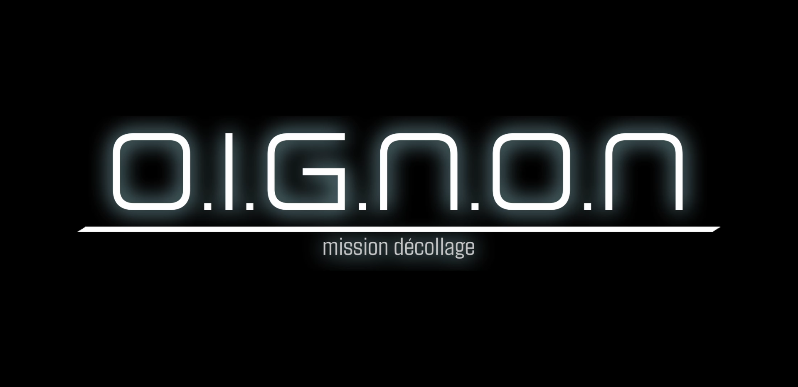
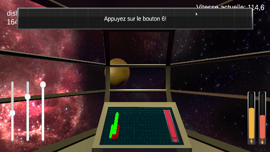
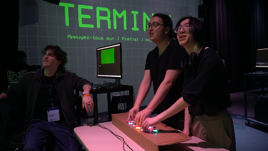
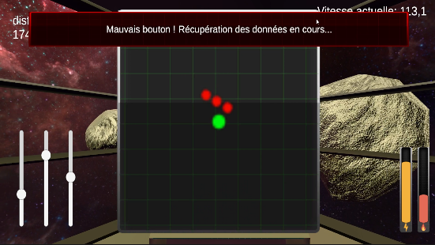
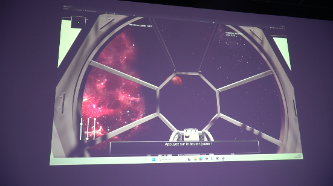
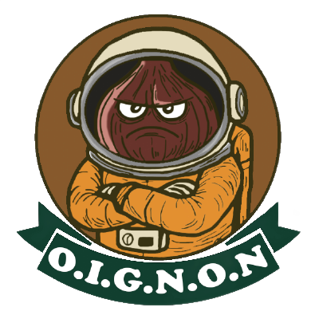

# Dossier de presse

## Fiche d’informations

**Développeur :**  
[Programme de Techniques d'intégration multimédia du Collège Montmorency](https://tim-montmorency.com/)

**Date de présentation :**  
Du 16 au 20 mars 2026.

**Forme :**  
Installation interactive

**Site Web du projet :**  
[Mission Décollage](https://o-i-g-n-o-n.github.io/Mission-decollage/#/) 

**Site Web de l'exposition collective :**  
[6tim-montmorency.com/2026](https://tim-montmorency.com/2026/#/)

**Prix :**  
Gratuit

## Description

Mission Décollage est une expérience coopérative pour 1 à 3 joueurs où tous se tiennent devant un panneau de contrôle rempli de boutons et d’interrupteurs afin de gérer les systèmes vitaux de la fusée, comme les propulseurs, le bouclier, la propulsion, le système de boost et d’autres mécanismes essentiels, dans une coordination parfaite, car rien ne peut fonctionner sans travail d’équipe. L’aventure commence lorsqu’un joueur appuie sur un bouton, lançant ainsi la première mission habitée vers une planète nouvellement découverte et potentiellement habitable, avec l’objectif d’y établir une présence humaine. Tout au long du voyage dans l’espace, les joueurs doivent esquiver les météorites, ajuster la trajectoire et maintenir la fusée opérationnelle pour atteindre leur destination et réussir l’atterrissage. Chaque décision compte : pour survivre et accomplir leur mission, ils devront communiquer efficacement, réagir rapidement et se faire confiance afin d’arriver sains et saufs et marquer l’histoire de l’exploration spatiale. 🚀

## Histoire
L’idée de cette expérience interactive a été développée par Justin Monpetit lors de la session dernière, dans le cadre du cours de conception d’expérience multimédia. Inspiré par sa passion pour les jeux vidéo et les univers immersifs, il a imaginé un concept centré sur la collaboration et la prise de décision en temps réel.

Comme nous partageons tous un intérêt pour les jeux vidéos et les expériences interactives, son idée a rapidement fait l’unanimité au sein de l’équipe. Nous avons donc décidé de la développer ensemble et d’enrichir le concept initial.

Au fil du processus, le projet a évolué grâce aux échanges d’idées et aux ajustements techniques. Nous avons travaillé à renforcer l’aspect immersif et coopératif afin de créer une expérience engageante où chaque action influence directement le déroulement de la mission.

## Fonctionnalités

1. **Mode coopératif (1 à 3 joueurs)**  
   Chaque joueur contrôle une partie spécifique de la fusée. La réussite dépend entièrement de la coordination et de la communication.

2. **Interface physique interactive**  
   Tableau de bord composé de boutons, sliders et encodeurs rotatifs, chacun assigné à une fonction précise (réacteurs, propulsion, stabilisation).

3. **Progression en temps réel (5–7 minutes)**  
   - Décollage coordonné  
   - Sortie d’orbite terrestre  
   - Navigation spatiale avec obstacles  
   - Atterrissage sur Mars

4. **Univers visuel en 3D**   
   - Vue à la première personne durant la phase spatiale

5. **Immersion sonore**  
   - Effets sonores et ambience diffusés par haut-parleurs pour renforcer la tension et l’expérience.

6. **Dimension sociale forte**  
   - Les joueurs sont debout, interagissent en direct et doivent se répartir les tâches efficacement pour réussir la mission.
   
## Bande-annonce

<!-- Bannderole / Bande-annonce -->
 

## Images
|  |  |
|----------------------------|------------------------------------|

|  |  |  |
|-----------------------------|------------------------------------|------------------------------|

## Logo

<!-- Autres sections d'un dossier de presse, moins pertinentes pour ce projet
## Logo & Icône
## Prix et reconnaissances
## Articles sélectionnés
 -->

## À propos de l'équipe de création

1. **Justin Montpetit – Programmeur du jeu**  
   Responsable de la programmation dans Unity, principalement en **C#**. Il a développé l’ensemble des mécaniques interactives et la logique du jeu.

2. **Ahmed Kaïssoumi – Intégrateur technique et UI**  
   Responsable de la connexion des composants matériels avec **Arduino**. Il a programmé les boutons et autres interfaces physiques pour interagir avec le jeu, et a également conçu l’**interface utilisateur (UI)** du jeu.

3. **Thearylou Lach – Modélisation 3D et textures**  
   Responsable de la création des **modèles 3D** et des **textures** utilisées dans le jeu, assurant l’aspect visuel et la cohérence esthétique des éléments numériques.

4. **Radhouane Kordan – Conception sonore**  
   Responsable de l’ensemble des **sons et ambiances sonores** du jeu, contribuant à l’immersion et à la dynamique de l’expérience.

5. **Jad Saloumi – Intégration et installation du projet**  
   Responsable de **l’intégration des sons dans le jeu**, ainsi que de l’**installation technique** du projet : projecteurs, haut-parleurs, lumières et connexions. Assure le bon fonctionnement de l’ensemble de l’installation.
   
## Crédits

Un grand merci aux **TTP** ainsi qu’à nos professeurs **Thomas Frederiks** et **Guillaume Arsenault** pour leur soutien et leurs conseils tout au long du projet.

## Contact

- **Justin Montpetit**  
  [LinkedIn](https://www.linkedin.com/in/justin-montpetit-924574397/) | [Portfolio](https://babouin-sibyllin.github.io/portfolio-Justin-Montpetit/)

- **Ahmed Kaïssoumi**  
  [LinkedIn](https://www.linkedin.com/in/ahmed-kaissoumi/)

- **Thearylou Lach**  
  [LinkedIn](https://linkedin.com/in/thearylou) | [Portfolio](https://thearyl.github.io/portfolio-thearylou-lach/)

- **Radhouane Kordan**  
  [LinkedIn](https://www.linkedin.com/in/radhouane-kordan/) | [Portfolio](https://rad8433.github.io/portfolio-radhouane-kordan/)

- **Jad Saloumi**  
  [LinkedIn](https://www.linkedin.com/in/saloumijad/) | [Portfolio](https://jad2087.github.io/portfolio-jad-saloumi/)

