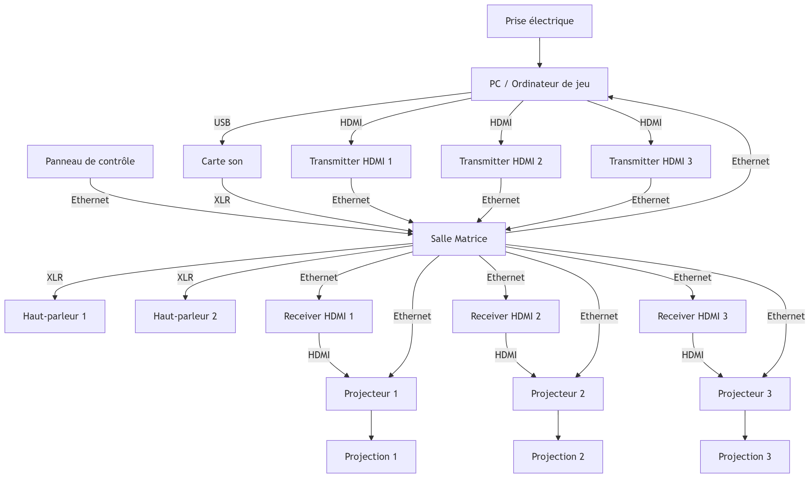
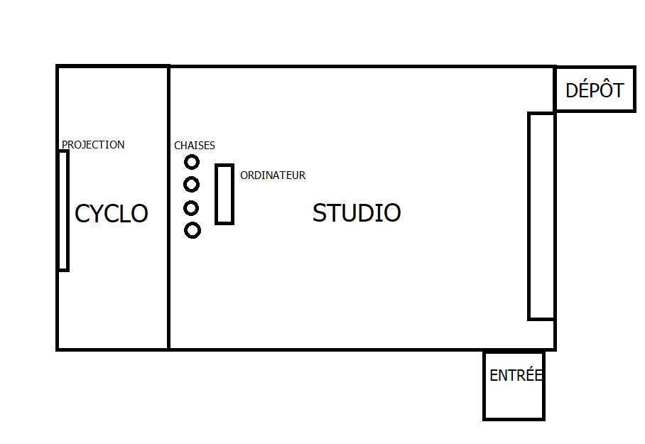
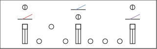

# Technique

## Équipements

- **Ordinateur** – x1  
  Utilité : Lancer le jeu, uploader le code sur les arduinos, lancer PureData, lancer OBS

- **Epson PowerLite 990U Projector** – x1  
  Utilité : Projeter au cyclorama le jeu

- **Epson PowerLite 535W Projector** – x2  
  Utilité : Projeter l'ambiance sur le cyclorama

- **Haut-parleur** - x2
  Utilité : Diffusion du son

- **Carte son Behringer UMC202HD** - x1
  Utilié : Transmettre le son aux haut-parleurs

- **Câble XLR** - 4x
  Utilité : Connecter la carte son à l'haut-parleur

- **Contrôleur Arduino M5Stack ATOM Lite ESP32** – x2  
  Utilité : Recevoir et transmettre la base du code aux autres logiciels (PureData, Unity)

   **Contrôleur Arduino mini** – x3  
  Utilité :  Recevoir et transmettre du code pour les composantes du tableau de bord

- **[PBHUB] I/O Hub 1 to 6 Expansion Unit (MEGA328)** – x1  
  Utilité : Étendre le nombre de composants à utiliser
  Justification du nombre : Un par station pour avoir une proximité avec les autres composants et nous laisser une marge pour les composants futurs

   **[GROVEHUB] I/O Hub 1 to 3 Expansion Unit** – x1  
  Utilité : Étendre le nombre de composants à utiliser
  Justification du nombre : Un par station pour avoir une proximité avec les autres composants et nous laisser une marge pour les composants futurs

- **Encodeur** – x3  
  Utilité : Reçoit les rotations du joueur et les transmet au contrôleur. Contrôle les fumées de côtés de la fusée.

- **BOUTON POUSSOIR (MOMENTARY)** – x6  
  Utilité : Reçoit les pressions du joueur et les transmet au contrôleur. Permet de remplir des objectifs / régler des problèmes

- **CÂBLE ETHERNET** – x12  
   Utilité : Deux câbles Ethernet sont utilisés pour connecter le projecteur et l’ordinateur à la salle Matrice, et un autre câble Ethernet relie le transmitter au receiver afin d’afficher le contenu du PC sur le projecteur.

  **SWITCH ETHERNET** – x1  
  Utilité : Avoir plusieurs port Ethernet disponible pour connecter au tableau de bord

- **TOGGLE SWITCH (SAFETY)** - x3
  Utilité: Améliorer l'expérience en ajoutant différentes composantes, autre que des boutons. Servent à activer/désactiver les réacteurs

- **ROTARY SWITCH** - x3
  Utilité: Améliorer l'expérience en ajoutant différentes composantes, autre que des boutons. Servent à activer le lancement de la fusée / remplir des objectifs / régler des problèmes

- **FADERS** - x3
  Utilité: Reçoit la position du fader attribué par le joueur. Permet de contrôler la puissance des réacteurs.

- **UNIT 3.96** - x12
  Utilité: Permet de gérer 2 inputs par composants.

  ***

## Logiciels

- **Unity**  
  Création du projet, des menus et du jeu  
  Gestion des scènes  
  Réception et traitement de l’OSC avec l’extension _extOSC_ disponible sur l’Asset Store

- **Pure Data**    
  Gestion de l’OSC et traitement et transfert des données reçus du contrôleur arduino sur Unity

- **Visual Studio Code & PlatformIO**  
  Développement et programmation sur le contrôleur arduino

- **Maya / Blender**  
  Création des assets 3D et de leurs animations nécessaires au jeu

- **OBS**  
  Utilisation pour la projection du jeu et de l'ambiance

- **Photoshop & Illustrator**  
  Création des assets 2D  
  Design des interfaces et éléments graphiques

- **Reaper**  
  Conception sonore & modification des sons de notre banque de son

- **Langages de programmation**  
  **C#** (Unity)  
  **C++** (Arduino)

---

## Synoptique

- Contrôle connecté à un controleur Arduino
- Audio connecté à la carte de son Behringer UMC202HD avec des longs cables XLR
- La vidéo est transmise depuis un ordinateur connecté par un câble HDMI à un émetteur. Cet émetteur HDMI est relié à un récepteur HDMI au moyen d’un câble Ethernet. Le récepteur est ensuite connecté au projecteur à l’aide d’un câble HDMI.

---

## Plans

---

<!--
Plans d'implantation 2D et 3D
-->

## Budget

| Produit                                                                                                                                                                  | Quantité | Prix réel          |
| ------------------------------------------------------------------------------------------------------------------------------------------------------------------------ | -------- | ------------------ |
| [Bouton LED rouge](https://abra-electronics.com/electromechanical/switches/pushbutton-switches-led/latching/pbs-led-2206rd-l.html)                                                 | x2       | 20.22 CAD ~      |
| [Bouton LED bleu](https://abra-electronics.com/electromechanical/switches/pushbutton-switches-led/latching/pbs-led-2206bl-l.html)                                                 | x2       | 20.22 CAD ~      |
| [Bouton LED verte](https://abra-electronics.com/electromechanical/switches/pushbutton-switches-led/latching/pbs-led-2206gn-l.html)                                                 | x2       | 20.22 CAD ~      |
| [Rotary Switch LED rouge](https://abra-electronics.com/electromechanical/switches/rotary-switches/2-position-momentary/rss-2pm-2206rd.html)                                                       | x1       | 20.17 CAD ~      |
| [Rotary Switch LED bleu](https://abra-electronics.com/electromechanical/switches/rotary-switches/2-position-momentary/rss-2pm-2206bl.html)                                                       | x1       | 20.17 CAD ~      |
| [Rotary Switch LED verte](https://abra-electronics.com/electromechanical/switches/rotary-switches/2-position-momentary/rss-2pm-2206gn.html)                                                       | x1       | 20.17 CAD ~      |
| [Toggle Switch](https://abra-electronics.com/electromechanical/switches/toggle-switches/com-11310-toggle-switch-and-cover-illuminated-red-com-11310.html)                  | x3       | 20.53 CAD ~      |
|[ Satin Pearl White Vinyl ](https://www.amazon.ca/dp/B08W6SZSQM?ref=ppx_yo2ov_dt_b_fed_asin_title&th=1)                  | x5       | 97.65 CAD ~      |
|[3M Ruban adhésif](https://www.amazon.ca/dp/B00JR4D70K?ref=ppx_yo2ov_dt_b_fed_asin_title)                  | x1       | 12.64 CAD ~      |
|[5/8-in x 4-ft x 8-ft Plywood Fir Standard](https://www.rona.ca/en/product/5-8-in-x-4-ft-x-8-ft-plywood-fir-standard-06010304-7476001)                  | x1       | 50.20 CAD ~      |
|[Hardboard Handy Panel 1/8" x 2' x 4' ](https://www.rona.ca/en/product/hardboard-handy-panel-1-8-x-2-x-4-white-8914019)                  | x1       | 9.42 CAD ~      |
**TOTAL**                                                                                                                                                                |          | **311.61 CAD ~** |

